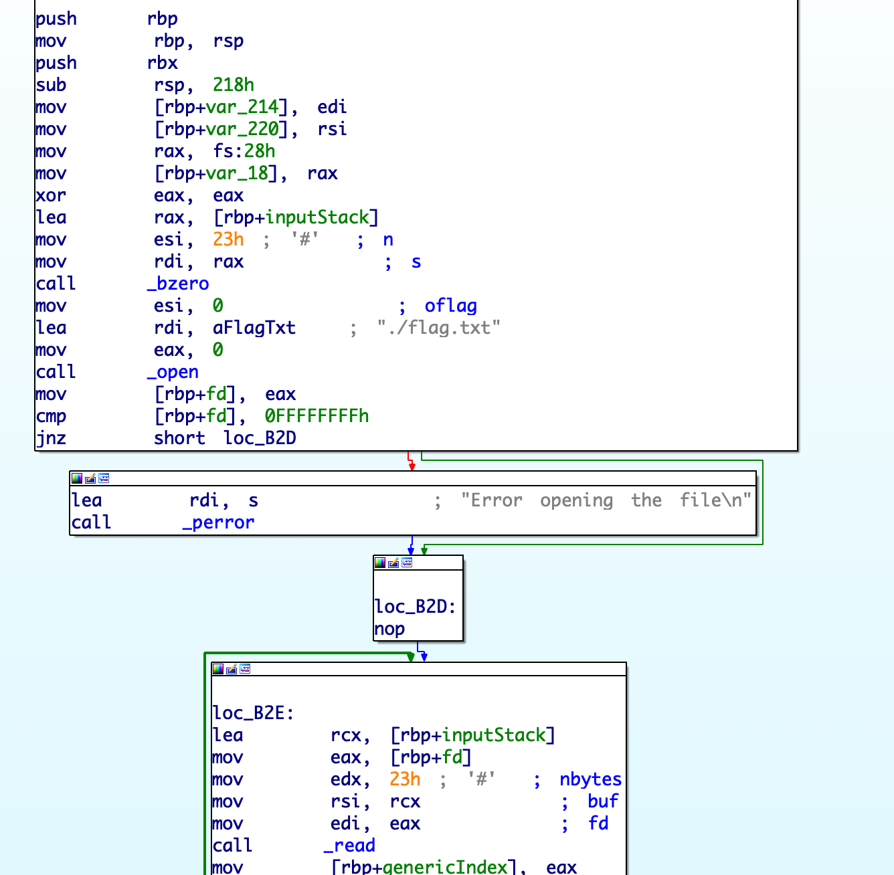
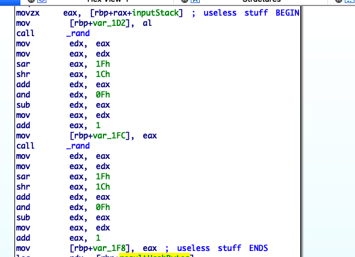
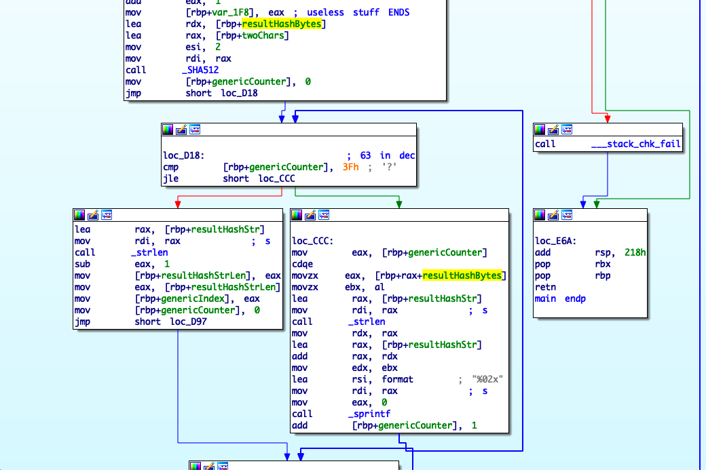
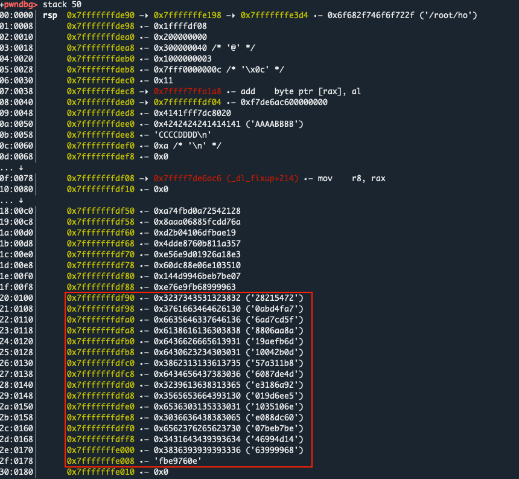
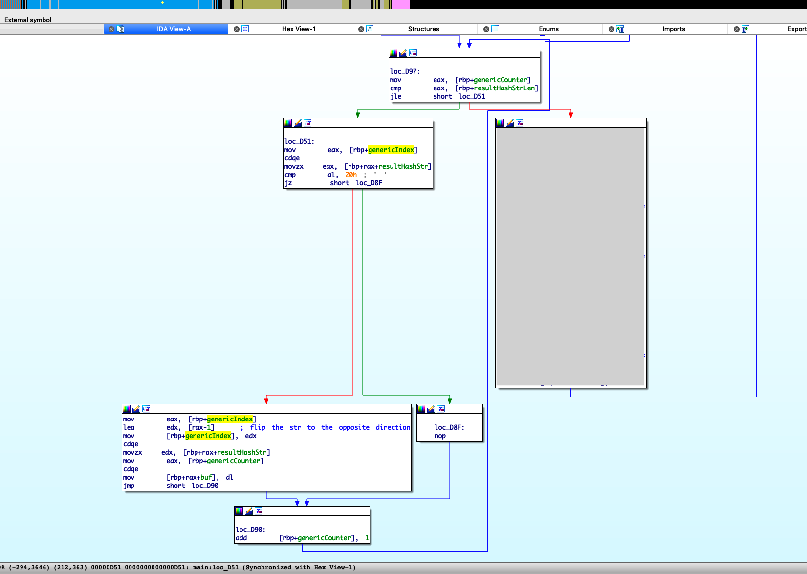
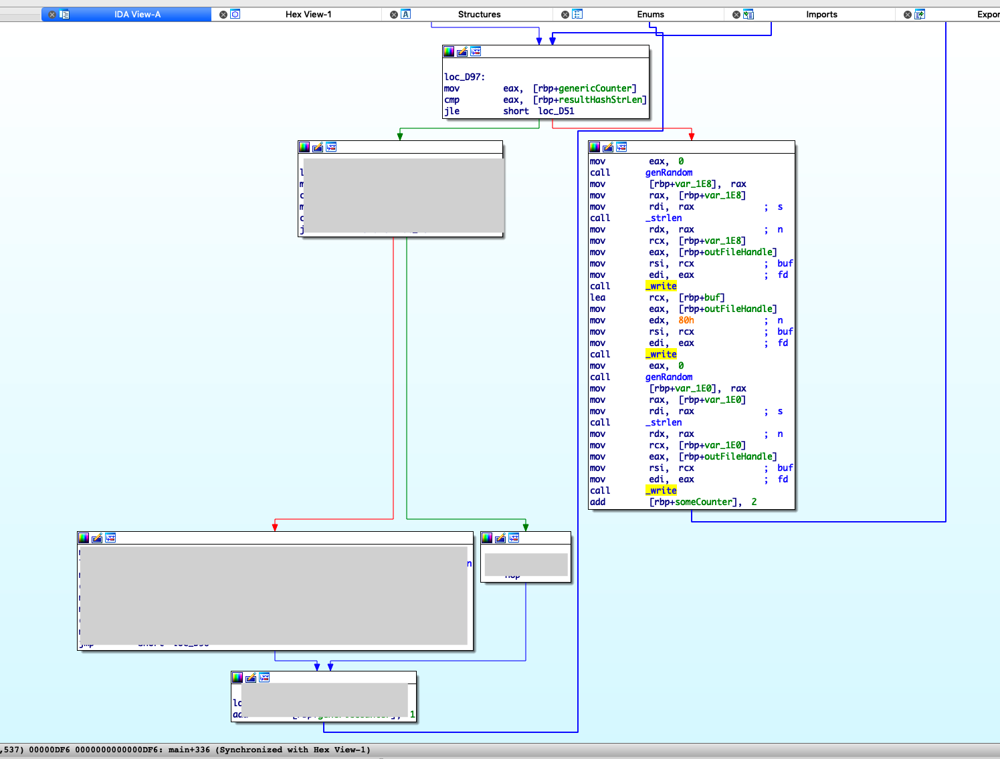
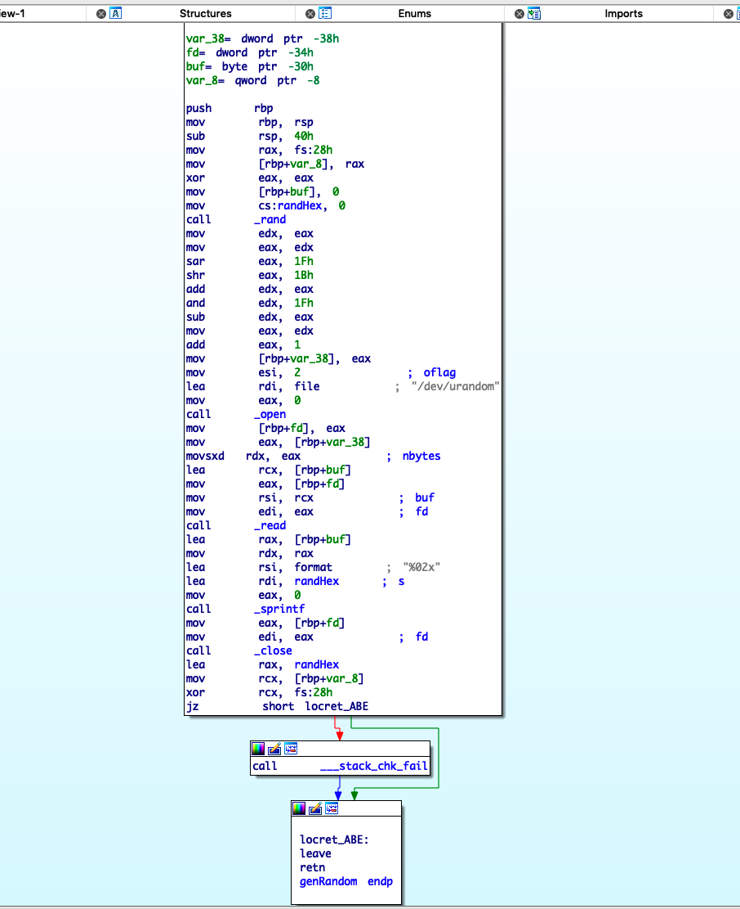
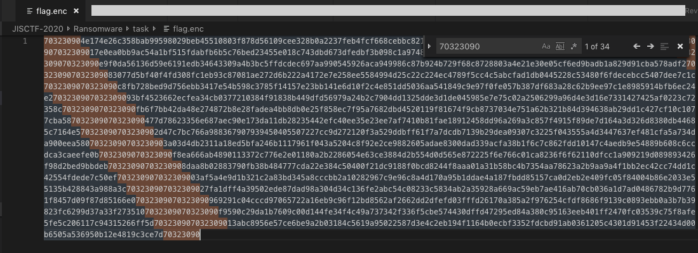
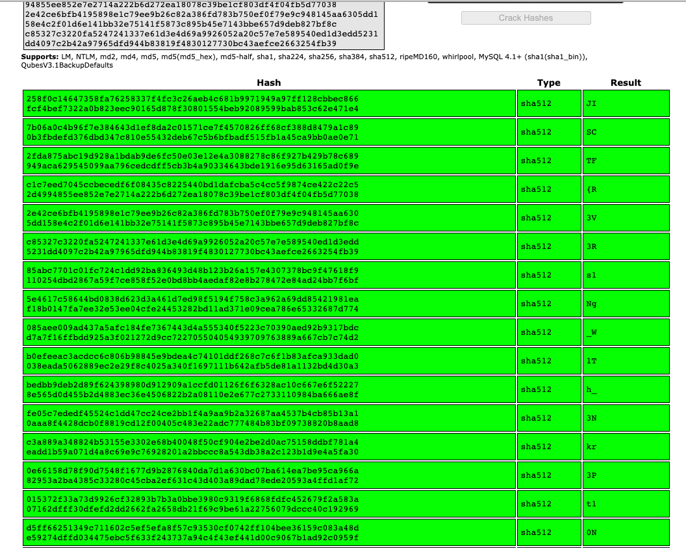

# Ransomware

This is a writeup for the last challenge in the RE section of JISCTF, called _Ransomware_.

In this challenge, we were given a ``Ransomware.zip`` archive, contains:

* ``./task/Ransomware`` - a binary
* ``./task/flag.enc`` - contains the flag, which has "infected" by the ``Ransomware`` binary.

Our task is to recover the original characters of the flag. To do that, we'll need to dig into the ``Ransomware`` binary. 

While reversing this on IDA, I did some re-naming to the variable names in the binary so it will be easier to understand the screenshots.


# Analysis

When trying to run the binary, it will fail:

```
(ins)$ ./Ransomeware
Error opening the file
: No such file or directory
```
This happens because it looks for a file called ``flag.txt`` in the current directory:



The program opens it, reads ``0x23`` bytes and put it on the stack (at ``[rbp+inputStack]``).

So next thing I tried was to create a ``flag.txt`` file and see the behaviour of the binary( ``echo "AAAABBBBCCCCDDDD" > flag.txt && ./Ransomware`` )

It created an ``out.txt`` file, containing the encrypted string:
```
a1db01a0e0679ebf8699993641d49964eb7beb7006cd880ee60153015ee6d91029a6813ed4ed78068b113a75d0b24001d6bfea91a8aa6088f5dc7da67af4dba027451282a1db01a0a1db01a0e0679ebf8699993641d49964eb7beb7006cd880ee60153015ee6d91029a6813ed4ed78068b113a75d0b24001d6bfea91a8aa6088f5dc7da67af4dba027451282a1db01a0a1db01a087a9642776fd74d9606f4aba682a3032aaf22008afc025863d6c393b491bbfd143a34e942371511a5ffec0e4dbb6eaf66721e362d41999012cf006dcedcf11b7a1db01a0a1db01a087a9642776fd74d9606f4aba682a3032aaf22008afc025863d6c393b491bbfd143a34e942371511a5ffec0e4dbb6eaf66721e362d41999012cf006dcedcf11b7a1db01a0a1db01a0ee1e81417d57b1a858d0e8d869890a512057acf83b8f022c0717ff69296c0756593b49555f15dc7c564c06d7653217ce37c6723c3f1a3b77987ba26078782398a1db01a0a1db01a0ee1e81417d57b1a858d0e8d869890a512057acf83b8f022c0717ff69296c0756593b49555f15dc7c564c06d7653217ce37c6723c3f1a3b77987ba26078782398a1db01a0a1db01a04771895fbb4fcb71d6dab6d7041e7475effd160f3651db79e1415de9f6192cffa935ac99f54f314938a5737ed24baf36bddbf15f376ffaa9560526cb804c0673a1db01a0a1db01a04771895fbb4fcb71d6dab6d7041e7475effd160f3651db79e1415de9f6192cffa935ac99f54f314938a5737ed24baf36bddbf15f376ffaa9560526cb804c0673a1db01a0
```

Awesome, so now we have a working binary and we can try to dig into how the cipher is implemented.

The loop which generates the ``out.txt`` file is divided into 3 parts:
* Step 1 - Useless calls to ``rand()``
* Step 2 - Hashing the ``flag.txt`` contents, 2 bytes at a time
* Step 3 - Obfuscating the the hashes and write them to a ``out.txt`` file

Each step is described below.

## Step 1 - Useless calls to ``rand()``

The binary performs some useless stuff, I assume they added this as "obfuscation"(the return value of those calls is not used anywhere in the program). It generates two random numbers with a seed of ``time(0)``:



## Step 2 - SHA512
Then, the input processing starts:




It's performing a ``_SHA512`` call only on **two chars** and saves the hash result in ``[rbp+resultHashBytes]`` on the stack. In our case, the binary will perform ``SHA512('AA')`` first, and on the 3rd iteration, it will call ``SHA512('BB')`` and so on(because our input is ``AAAABBBBCCCCDDDD``).

Later, it takes ``[rbp+resultHashBytes]`` and turn the raw SHA512 bytes into a hex string by calling ``sprintf`` along with a ``%02x`` format specifier.

When the ``sprintf`` loop is over, the string version of the hash will be placed on the stack at ``[rbp+resultHashStr]`` :



## Step 3 - Writing an outfile

This one was trickey, the binary didn't print the hashed string in as it looked on the stack(from the previous screenshot). Instead, the binary writes the hash string **backwards**:



When it finishes flipping the direction of the hash string, it writes is to  ``out.txt``:



As can be seen above, there are 3 calls to ``write`` and not one. This is because the hashes are written to the file with a prefix and a suffix, which comes from ``genRandom()``. The following screenshot shows the disassembly of ``genRandom()``:



The funny thing with the call to the ``genRandom`` function is: the return value will be changed on every execution of the binary, and not every hash in the loop. This means that if (for example) we have 4 hashes: the prefix and suffix of each will be the same to all.


# Getting the flag

To recover the flag, we'll need to do the steps in the reverse order:

Step 1 -  Extract the hashes - we know that all the hashes has the same prefix & suffix, so we can identify them by seraching the last 8 characters of ``flag.enc``:



Step 2 - Flip the hashes direction

```py
f = open('./flag.enc', 'r')
content = f.read()
hashes = list(filter(lambda h: h!='', content.split('70323090')))

for h in hashes:
    print(h[::-1])


```

Output:

```
258f0c14647358fa76258337f4fc3c26aeb4c681b9971949a97ff128cbbec866fcf4bef7322a0b823eec90165d878f30801554beb92089599bab853c62e471e4
7b06a0c4b96f7e384643d1ef8da2c01571ce7f4570826ff68cf388d8479a1c890b3fbdefd376dbd347c810e55432deb67c5b6bfbadf515fb1a45ca9bb0ae0e71
2fda875abc19d928a1bdab9de6fc50e03e12e4a3088278c86f927b429b78c689949aca629545099aa796cedcdff5cb3b4a90334643bde1916e95d63165ad0f9e
c1c7eed7045ccbecedf6f08435c8225440bd1dafcba5c4cc5f9874ce422c22c52d4994855ee852e7e2714a222b6d272ea18078c39be1cf803df4f04fb5d77038
2e42ce6bfb4195898e1c79ee9b26c82a386fd783b750ef0f79e9c948145aa6305dd158e4c2f01d6e141bb32e75141f5873c895b45e7143bbe657d9deb827bf8c
c85327c3220fa5247241337e61d3e4d69a9926052a20c57e7e589540ed1d3edd5231dd4097c2b42a97965dfd944b83819f4830127730bc43aefce2663254fb39
85abc7701c01fc724c1dd92ba836493d48b123b26a157e4307378bc9f47618f9110254dbd2867a59f7ce858f52e0bd8bb4aedaf82e8b278472e84ad24bb7f6bf
5e4617c58644bd0838d623d3a461d7ed98f5194f758c3a962a69dd85421981eaf18b0147fa7ee32e53ee04cfe24453282bd11ad371e09cea786e65332687d774
085aee009ad437a5afc184fe7367443d4a555340f5223c70390aed92b9317bdcd7a7f16ffbdd925a3f021272d9cc722705504054939709763889a667cb7c74d2
b0efeeac3acdcc6c806b98845e9bdea4c74101ddf268c7c6f1b83afca933dad0038eada5062889ec2e29f8c4025a340f1697111b642afb5de81a1132bd4d30a3
bedbb9deb2d89f624398980d912909a1ccfd01126f6f6328ac10c667e6f522278e565d0d455b2d4883ec36e4506822b2a08110e2e677c2733110984ba666ae8f
fe05c7ededf45524c1dd47cc24ce2bb1f4a9aa9b2a32687aa4537b4cb85b13a10aaa8f4428dcb0f8819cd12f00405c483e22adc777484b83bf09738820b8aad8
c3a889a348824b53155e3302e68b40048f50cf904e2be2d0ac75158ddbf781a4eadd1b59a071d4a8c69e9c76928201a2bbccc8a543db38a2c123b1d9e4a5fa30
0e66158d78f90d7548f1677d9b2876840da7d1a630bc07ba614ea7be95ca966a82953a2ba4385c33280c45cba2ef631c43d403a89dad78ede20593a4ffd1af72
015372f33a73d9926cf32893b7b3a0bbe3980c9319f6868fdfc452679f2a583a07162dfff30dfefd2dd2662fa2658db21f69c9be61a22756079dccc40c192969
d5ff66251349c711602c5ef5efa8f57c93530cf0742ff104bee36159c083a48de59274dffd034475ebc5f633f243737a94c4f43ef441d00c9067b1ad92c0959f
d7ec3c9184e21b059635a5056b00d43422f35419d1034c5021630ba19dbcdf2533fbce0b4611f491be2c4e3d78522059a9165c48130b2a9eb6ec75e6598cba31
```

We got the hashes.

Because each hash is originally 2 characters. A simple lookup on rainbow-table sites like [crackstation.net](https://crackstation.net/) will do the trick:



the flag: ``JISCTF{R3V3Rs1Ng_W1Th_3Nkr3Pt10N}``

