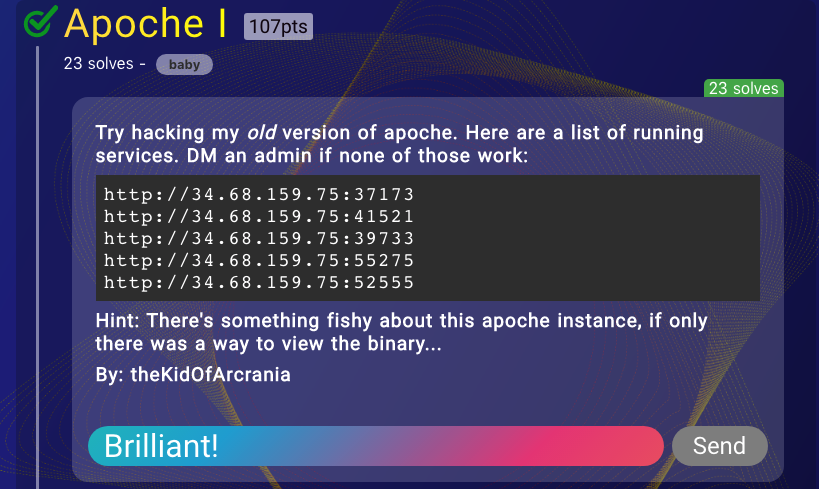
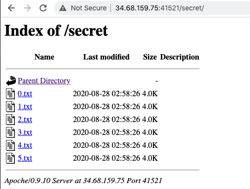
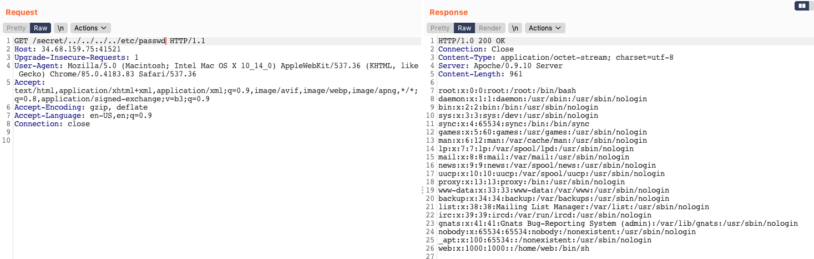
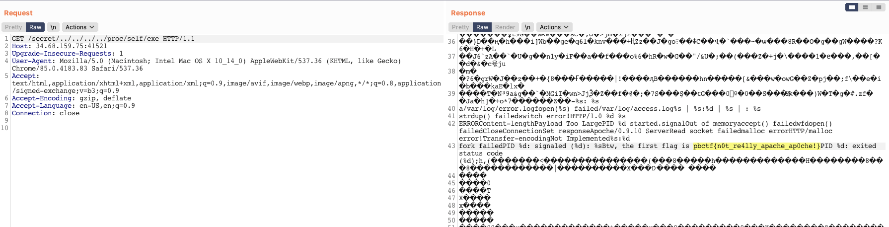

# Apoche 

**Category**: Web

**The task**:



# Solution

First, we discover the ``/secret/`` directory using ``/robots.txt``:



The ``.txt`` files contains the site admin's "journal", which supposed to give us hints:

```
0.txt
================
2018-09-09

Today I started drafting this cool new C webserver, named APOCHE! OWO 

(Totally not related to the naming of apache). Pretty sure they stole my name
because I came up with this name so many years ago! https://xkcd.com/827/

I decided to dedicate my server to the hosting of some free weeb pics OWO.

--
theKidOfArcrania


1.txt
================
2018-10-21

Today was a dull and boring day, still working out this server, which I realize
is taking on a heavy toll on top of regular univ work.

Totally been painful to try to complete this work.

Hopefully, one day it will be functional. I might get more time over the break.

--
theKidOfArcrania


2.txt
================
2018-12-12

Oof finally got out of exams. Can finally start doing some major work on this!
Hahaha I'm excited!

--
theKidOfArcrania


3.txt
================
2018-12-26

Hi, I've finally perfected my new C webserver (after working 10 or so days on
this), very excited to see it to use.

There's still a couple of bugs I need to kink out, but it should be fine, right?

Nothing at all to exploit :^)

Regrettably, I haven't really tried testing it with a large load yet... :( maybe
when my website gets popular, I'll let the users to test it.

--
theKidOfArcrania


4.txt
================
2019-12-18

Oh came back to this old project, looks like from the logs somebody has been
hacking into my /secret/ folder 😠😠😠. Not funny.

Okay I decided to put my secret info into /var/www/secret instead :P

--
theKidOfArcrania


5.txt
================
2020-01-02

It's the second day of the NEW YEAER! quite exciting

I just noticed somebody was trying to access my /var/www/secret data 😢
so I decided to filter out '/' and '.' characters in the beginning of the path.

Maybe I should stop logging stuff here... not safe 

--
theKidOfArcrania

```

From the txt files, we can understand that this is an "apoche" server written in C (probablly just a vulnerable apache module). 

First thing I tried was a directory traversal:



Nice, it worked.

To get the flag, simply pull the _Apoche_ binary by leaking ``/proc/self/exe``:



