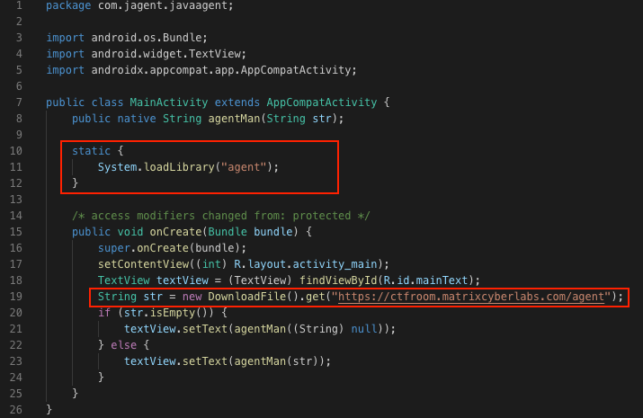
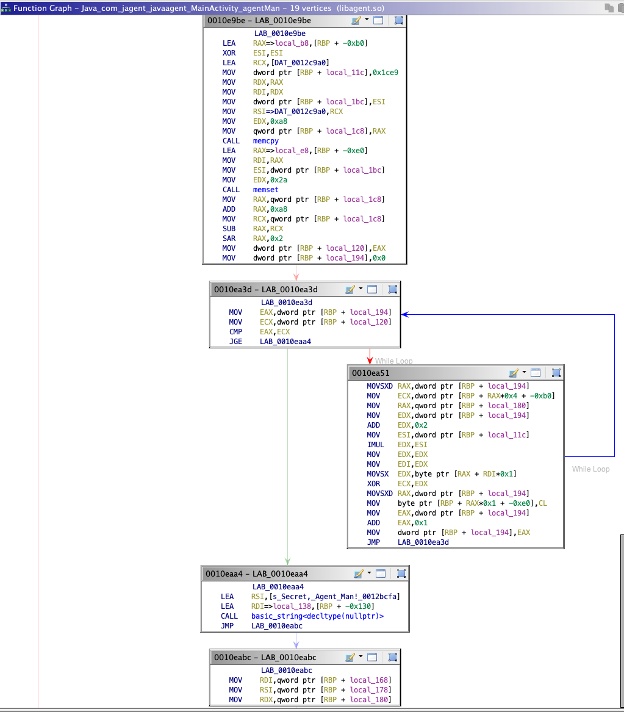
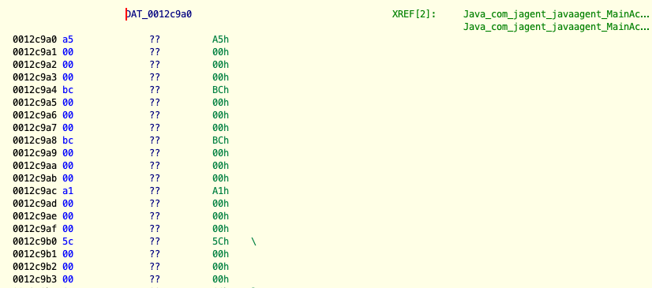

# Agent Man 

**Category**: Mobile

**The task**: We were given an apk that basically does nothing. However, if we dig deeper into the native layer, we'll find a ``.so`` file that we need to reverse engineer in order to get the flag.

# Analysis

The apk tries to fetch an image ([./digDeeper.jpg](./digDeeper.jpg)) and provide the response to a native method (``agentMan()``).



After messing around with the ``.so`` file, I found the 'decryption' implementation in the ``Java_com_jagent_javaagent_MainActivity_agentMan`` exported function:



Explanation is below

# Solution

I'll break the screenshot above into 4 'components':
* **(1) The Algo**: This is a typical XOR cipher 
* **(2) The Flag**: This flag is hidden inside ``digDeeper.jpg`` (provided as a parameter to the decryption native method)
* **(3) The Key**: In the first few lines of the disassembly, the apk loads a constant variable(``DAT_0012c9a0``) and copies ``0xa8`` bytes of it using ``memcpy``. This will be our XOR key (``A5 00 00 00 BC ...``).

* **(4) The Implementation**: This part was kinda trickey. The author of the challenge didn't want to make it too obvious and put the encrypted flag characters one after another somewhere in the jpg file. Instead, the flag's characters were being spread out all over the jpg file. one character for every 7401(``0x1CE9``) bytes of binary data. 

Taking all of this into consideration, I came up with a ``solve.py`` file which re-produces the loop(the one shown in the _Analysis_ section above):

```py
#!/usr/bin/env python

import binascii

dig_deeper = open('./digDeeper.jpg', 'rb').read()
jump       = 0x1ce9
const_var  = binascii.unhexlify(('a5 00 00 00 bc 00 00 00 bc 00 00 00 a1 00 00 00 5c 00 00 00 6c 00 00 00' +
                                'dc 00 00 00 00 00 00 00 3c 00 00 00 16 00 00 00 9c 00 00 00 42 00 00 00' +
                                '2d 00 00 00 28 00 00 00 db 00 00 00 c8 00 00 00 c0 00 00 00 27 00 00 00' +
                                '21 00 00 00 29 00 00 00 41 00 00 00 08 00 00 00 19 00 00 00 c0 00 00 00' + 
                                '44 00 00 00 8b 00 00 00 1c 00 00 00 2f 00 00 00 27 00 00 00 1f 00 00 00' + 
                                '03 00 00 00 b2 00 00 00 3d 00 00 00 f3 00 00 00 ed 00 00 00 14 00 00 00' +
                                '15 00 00 00 fe 00 00 00 2b 00 00 00 d6 00 00 00 e1 00 00 00 55 00 00 00').replace('00 00 00', '').replace(' ',''))

flag = '' 
for j in range(0, len(const_var)):
    i   = const_var[j]
    out = chr(dig_deeper[(j+2)*jump] ^ i)
    flag += out
    
print(flag)

```

Output:

```
MCL{li7tl3_5P3c1al_S3crET_Ag3n7_'\'m3n'\'}
```
