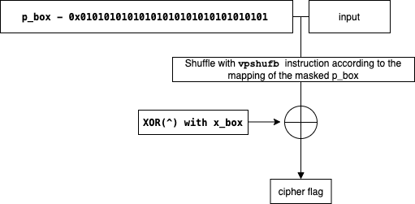
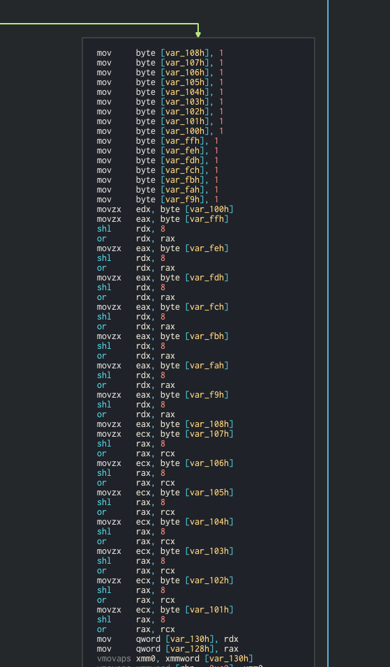
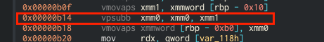
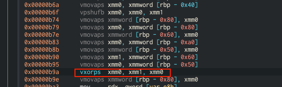

# SSE_KEYGENME

The task:
>Like in the good old days, but faster.
>
>SSE_KEYGENME - https://kaf-public.s3-eu-west-1.amazonaws.com/SSE_KEYGENME/SSE_KEYGENME

In this challenge, we were given a binary:
```
$ ./SSE_KEYGENME
###############################
### WELCOME TO SSE_KEYGENME ###
###      ENJOY YOUR STAY    ###
###############################
Enter key:
> AAAAAAAAAAAA
Wrong key, try again...
```

The ``flag`` is a static variable, lays in the ``.rodata`` section:
```
+pwndbg> x/32xb &flag
0xe40 <flag>:           0x43    0x51    0x43    0x36    0x40    0x52    0x21    0x55
0xe48 <flag+8>:         0x24    0x42    0x5b    0x68    0x7d    0x67    0x1f    0x7b
0xe50 <flag+16>:        0x5d    0x7e    0x4e    0x0e    0x58    0x04    0x22    0x40
0xe58 <flag+24>:        0x1e    0x14    0x16    0x2c    0x20    0x22    0x26    0x34
```

However, this is an encrypted version of the flag.

What the program does is:
* gets a string input from the user
* encrypt the input
* checks whether the encrypted input == the flag
  * if it does, it prints ``Success! Enjoy the rest of the competition :)``
  * if it doesn't, it prints ``Wrong key, try again...``

There are two approaches of solving this challenge:

1. Brute-force techniques(**the nasty way**): guessing each letter at a time in a dynamic analysis/ugly GDB scripting until you'll get the full decrypted string.
2. Reverse engineer the program and learn how the encryption is implemented so you can write your own decryption script.

This write-up covers the 2nd approach. 

# Technical Analysis

## Prerequisites
In order to read this writeup without being too frustrated, you'll need to understand:
* A little bit about [Concepts of Substitution–permutation Networks](https://www.youtube.com/watch?v=DLjzI5dX8jc) . In the binary, it is implemented using the variables ``p_box`` and ``x_box`` (which are also mentioned in this video. Referred as "*S box* and *X box*")
* Basic stuff about SSE registers (being familiar with ``xmm0``, ``xmm1`` registers is enough)
* ``pshufb`` instruction(awesome demo at 8:05): https://www.youtube.com/watch?v=rBYrQ1OEhik


## How the program encrypts our input

The program uses a 128bit block cipher and the flag length is 2 blocks / 32 bytes(``0x20``).

The cipher implementation goes as follows(each step is covered below):
* Step 1, Padding - if the input text is less than 32 bytes(``0x20``), the program will be pad it with extra bytes.
* Step 2, Shuffling - Shuffles our input to add complexity using the ``pshufb`` instruction.
* Step 3, XORing - Adding more uniqueness to each byte in the final ciphertext.

Padding is kinda boring, so I'll jump straight to the interesting steps: Shuffling & XORing



### Step 2 - Shuffling

The program takes the first 16 bytes of the input(block of 128 bits) and shuffles the order of the characters using the ``pshufb``:
1. First, the program "generates" a 16-byte variable using the following instructions sequence:



The program is doing a lot of repetative left shifting until it completes a full 128bit block.(which is made out of ``0x01``s).

Essentially, the following one-liner will yield the same result: ``some_var = 0x01010101010101010101010101010101``. 


2. Then, the program takes the ``p_box`` variable and substract ``0x01010101010101010101010101010101`` from it:



```
p_box:           0x4090a0d0f0b081003060c010e050702
mask:            0x1010101010101010101010101010101
p_box "masked":  0x308090c0e0a070f02050b000d040601
```

3. It's using the result(``0x308090c0e0a070f02050b000d040601``) as the **shuffle map** when the shuffle is performed. If you're wondering how the ``pshufb`` instruction works and what exactly that map is: you should check out the URLs in the "Prerequisites" section above.


### Step 3 - XORing

When the shuffle is completed, the binary XORing the result with ``x_box``.

The contents of ``x_box`` is below:
```
+pwndbg> x/16xb &x_box
0xe30 <x_box>:      0x02    0x03    0x05    0x07    0x0b    0x0d    0x11    0x13
0xe38 <x_box+8>:    0x17    0x1d    0x1f    0x25    0x29    0x2b    0x2f    0x00
```

As can be seen in the screenshot below, the program uses (again) the SSE registers here as well to perform the XOR operation on 16 bytes at a time:



And that's it, we're done cooking one cipher block :D now the same process repeats itself for the next 16 bytes/128bits of your input. 

## Writing a decryption script

If we want to decrypt the cipher flag, we can just perform the steps above in reverse order:
* **Recover the original characters**: XOR the blocks of the cipher flag with ``x_box``
* **Invert the permutation**: Reverse shuffle the blocks and clean up the mess that the ``pshufb`` instruction made.

Below is the decryption script:

```py
# ----------- helpers ------------------------------
def reverse_shuffle(ciphertext, mapping):
    result = bytearray( [0, 0, 0, 0, 0, 0, 0, 0, 0, 0, 0, 0, 0, 0, 0, 0] )
    cursor = 0
    for i in mapping:
        result[i] = ciphertext[cursor] # map

        cursor += 1
    return result


def xor_box(text, xor_map):
    result = bytearray( [0, 0, 0, 0, 0, 0, 0, 0, 0, 0, 0, 0, 0, 0, 0, 0] )
    for i in range(0, len(xor_map)):
        result[i] = text[i] ^ xor_map[i]
    
    return result
# ---------------------------------------------------


# init vars
# ------------
flag_cipher = bytearray([0x43, 0x51, 0x43, 0x36, 0x40, 0x52, 0x21, 0x55, 0x24, 0x42, 0x5b, 0x68, 0x7d, 0x67, 0x1f, 0x7b, 0x5d, 0x7e, 0x4e, 0x0e, 0x58, 0x04, 0x22, 0x40, 0x1e, 0x14, 0x16, 0x2c, 0x20, 0x22, 0x26, 0x34])

# p_box
p_box_raw = bytearray( [0x02,0x07,0x05,0x0e,0x01,0x0c,0x06,0x03, 0x10,0x08,0x0b,0x0f,0x0d,0x0a,0x09,0x04] )
p_box = int.from_bytes(p_box_raw, byteorder='little')

mask = 0x01010101010101010101010101010101
p_box_masked = (p_box - mask) # our lookup table is ready :D
p_box_masked_map = p_box_masked.to_bytes(16, byteorder='little')

# x_box
x_box_raw = bytearray([0x02,0x03,0x05,0x07,0x0b,0x0d,0x11,0x13, 0x17,0x1d,0x1f,0x25,0x29,0x2b,0x2f,0x00])


# main
# ------------

# xoring
flag_cipher[0:16] = xor_box(flag_cipher[0:16], x_box_raw)   # 1st block
flag_cipher[16:32] = xor_box(flag_cipher[16:32], x_box_raw) # 2nd block

# inverting the permutation
shuffled  = reverse_shuffle(flag_cipher[0:16], p_box_masked_map)
shuffled += reverse_shuffle(flag_cipher[16:32], p_box_masked_map)


print( 'plaintext:', shuffled.decode('utf-8') )
```

Output:
```
plaintext: KAF{F0R_0LD_T1M3S_S4K3}
```


# Special Kudos

When I solved this challenge, I didn't know why my decryption script f**ked up and showed only part of the flag. It was really weird.

After the CTF ended, I showed @lior5654 (random dude I found on the discord channel) my solution and he said that I was actually on the right track. **However**, I used the wrong endianness + flipped the array indexes when trying to recover the permutation, it created a weird output that might look like the flag, but not exactly the flag (more like a drunk flag lol). So thanks for taking the time to correct my (shitty) python syntax at the middle of the night :D 

